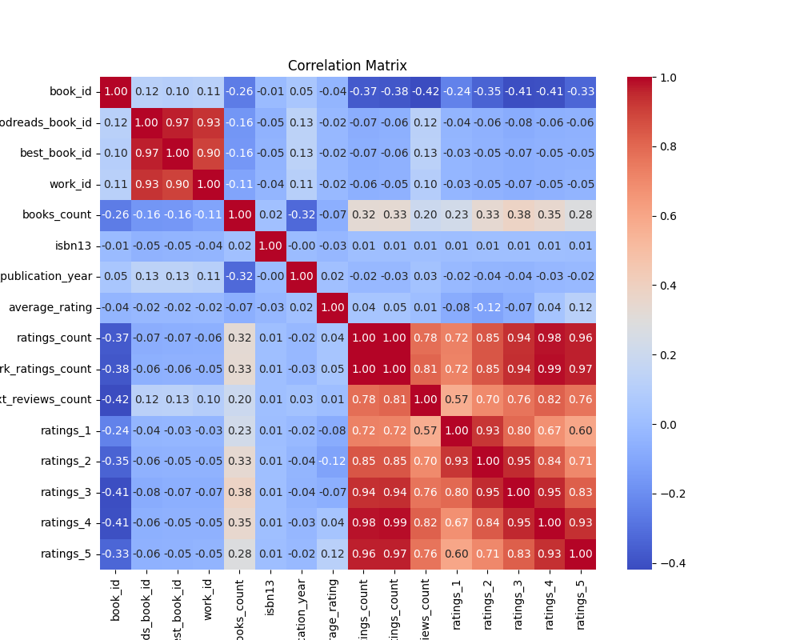
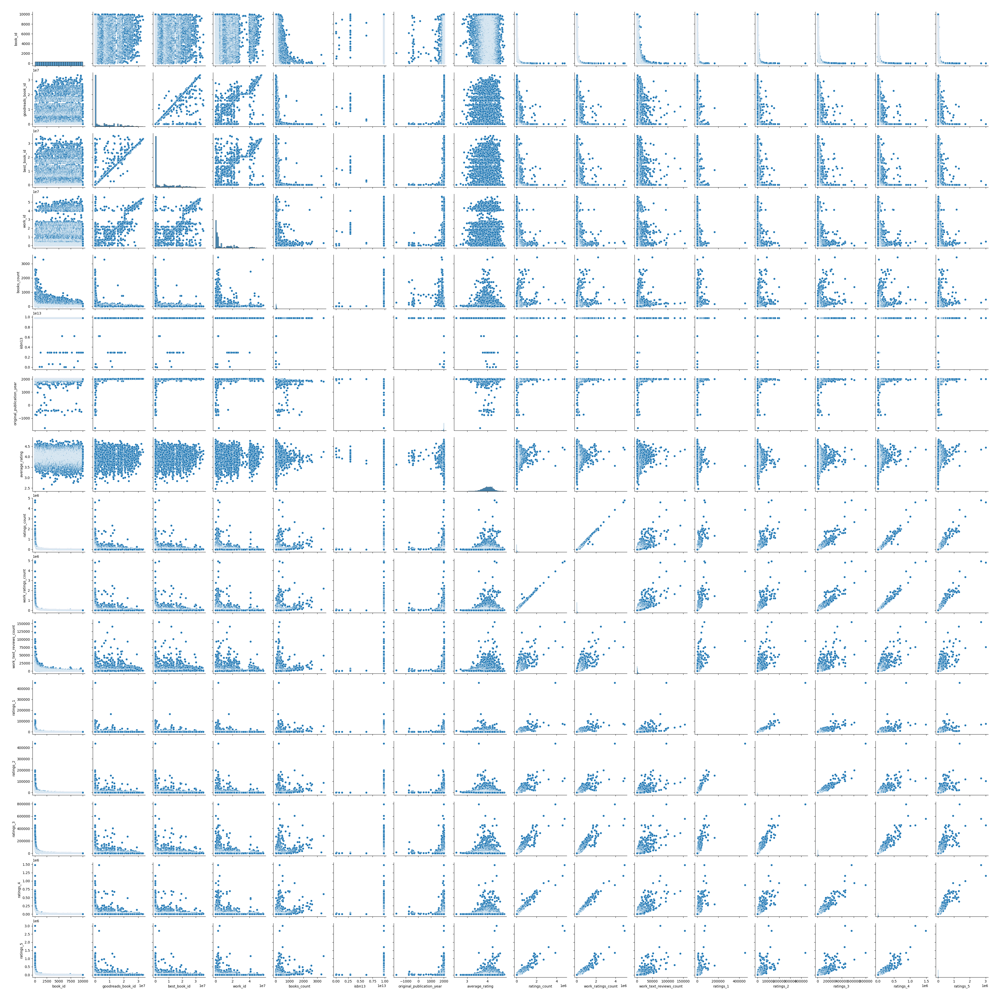

**Unveiling Literature: Insights from the Goodreads Dataset**

In the age of digital storytelling, books remain a timeless source of knowledge, entertainment, and inspiration. Today, we delve into a captivating dataset containing 10,000 entries from Goodreads, a popular platform for book lovers. This dataset encompasses 21 columns, including essential features such as authors, publication years, average ratings, and various rating counts, offering a treasure trove of insights into the world of literature.

### A Glimpse at the Data Landscape

As we explore this dataset, we are greeted with a robust collection of books, each with unique identifiers like `book_id`, `goodreads_book_id`, and `work_id`. Notably, the dataset has no missing values for these IDs, indicating a well-structured catalog of literature. However, some columns present challenges with missing values—most notably, the ISBN numbers (700 missing entries) and original titles (585 missing entries). This raises questions about the completeness of the dataset and the implications for data analysis.

### The Power of Ratings

One of the most intriguing aspects of this dataset is the ratings system. With an average rating of 4.00 out of 5, it's evident that readers tend to favor the books included in this dataset. The ratings distribution reveals a significant preference for higher ratings: approximately 23,790 ratings fall into the five-star category, while only 1,345 are rated one star. This stark contrast suggests a tendency for readers to gravitate towards books that resonate positively with them.

With 54,001 average ratings per book, it’s also clear that some titles have garnered substantial attention, leading to a wealth of user feedback. The sheer volume of ratings—ranging from 2,716 for the lowest-rated books to a staggering 4,780,653 for the most popular—provides a rich context for understanding reader preferences.

### Trends in Publication

Turning our attention to publication years, we observe a fascinating trend. The dataset spans books published as early as 1750 to as recent as 2017. The average original publication year is 1982, suggesting a significant number of classic titles still hold relevance among modern readers. Interestingly, 21 entries are missing publication years, which could indicate either self-published works or previously unpublished manuscripts.

### Language Diversity

The dataset also showcases linguistic diversity, with 1,084 missing entries in the `language_code` column. The predominant language is English, followed by a variety of other languages, reflecting the global nature of literature and its extensive reach across cultures.

### Clustering Insights

To further understand the relationships between books, we employed KMeans clustering and hierarchical clustering techniques. The analysis revealed three distinct clusters based on attributes such as average ratings and count of ratings. This segmentation provides valuable insights into how different types of books resonate with readers, allowing publishers and authors to tailor their offerings accordingly.

### Outliers on the Horizon

An intriguing aspect of the analysis is the identification of outliers—books that stand out from the crowd due to their extraordinary ratings or reviews. These outliers not only represent the pinnacle of literary achievement but also serve as case studies for understanding what makes certain books resonate profoundly with readers. Authors like J.K. Rowling and Stephen King are among the names that emerge from the dataset, showcasing the power of storytelling and its ability to captivate audiences.

### Conclusion: A Narrative in Numbers

As we conclude our exploration of the Goodreads dataset, we reflect on the powerful narratives embedded within the numbers. This dataset is not just a collection of books; it is a testament to the enduring love for literature that transcends time and space. It reveals the preferences of readers, the trends in publishing, and the dynamics of literary success. 

In a world driven by data, this dataset serves as a reminder that behind every book lies a story, a connection, and an opportunity for discovery. Let us continue to celebrate the written word and the stories that unite us all.
### Exploratory Data Analysis
### CSV File Name: goodreads.csv
### Dataset Overview
- **Shape:** 10000 rows and 21 columns
### Columns and Data Types:
```plaintext
book_id                        int64
goodreads_book_id              int64
best_book_id                   int64
work_id                        int64
books_count                    int64
isbn                          object
isbn13                       float64
authors                       object
original_publication_year    float64
original_title                object
title                         object
language_code                 object
average_rating               float64
ratings_count                  int64
work_ratings_count             int64
work_text_reviews_count        int64
ratings_1                      int64
ratings_2                      int64
ratings_3                      int64
ratings_4                      int64
ratings_5                      int64
```
### Sample Rows:
```plaintext
      book_id  goodreads_book_id  best_book_id   work_id  books_count        isbn        isbn13                                            authors  original_publication_year                                                                                                                       original_title                                                                                                                                title language_code  average_rating  ratings_count  work_ratings_count  work_text_reviews_count  ratings_1  ratings_2  ratings_3  ratings_4  ratings_5
1483     1484              77565         77565   1882596           74   553288202  9.780553e+12                                        Dan Simmons                     1990.0                                                                                                                 The Fall of Hyperion                                                                                           The Fall of Hyperion (Hyperion Cantos, #2)           eng            4.18          63235               68811                     2265        675       2454      10805      25016      29861
9989     9990             294081        294081     14081           40   140143912  9.780140e+12                                     Oscar Hijuelos                     1989.0                                                                                                   The Mambo Kings Play Songs of Love                                                                                                   The Mambo Kings Play Songs of Love           eng            3.68           9107                9776                      421        374        836       2692       3513       2361
453       454             767680        767680   3132746           41    60245867  9.780060e+12                 Laura Joffe Numeroff, Felicia Bond                     1985.0                                                                                                         If You Give a Mouse a Cookie                                                                                                         If You Give a Mouse a Cookie         en-US            4.24         198083              198778                     3016       3208       7772      32336      50573     104889
9282     9283              31819         31819     32035           10   812694554  9.780813e+12                      David Baggett, Shawn E. Klein                     2004.0                                                                               Harry Potter and Philosophy: If Aristotle Ran Hogwarts                                                                               Harry Potter and Philosophy: If Aristotle Ran Hogwarts           NaN            4.45           9264                9316                       82        197        274        955       1641       6249
9608     9609             400906        400906    390332           23   812508440  9.780813e+12                                          Glen Cook                     1985.0                                                                                                                       The White Rose                                                                             The White Rose (The Chronicles of the Black Company, #3)         en-US            4.19          11501               12063                      298         52        256       1901       5044       4810
6112     6113               7663          7663   2651727           57   451210638  9.780451e+12                   Jeffery Hudson, Michael Crichton                     1968.0                                                                                                                       A Case of Need                                                                                                                       A Case of Need         en-US            3.60          14109               16047                      563        291       1448       5632       5664       3012
7111     7112            3122173       3122173   3153516           20   312947062  9.780313e+12                                   Sherrilyn Kenyon                     2008.0                                                                                                                     One Silent Night                                                                                                   One Silent Night (Dark-Hunter #15)           eng            4.13          21869               23318                      750        183        994       4558       7546      10037
1449     1450             927979        927979   2054834           31   451461894  9.780451e+12                                        Jim Butcher                     2008.0                                                                                                                          Small Favor                                                                                                 Small Favor (The Dresden Files, #10)         en-US            4.43          70029               76253                     1975         69        419       6473      28646      40646
2380     2381            1829709       1829709   3236104           47   316002860  9.780316e+12                                    James Patterson                     2008.0                                                                                                                    The Final Warning                                                                                                 The Final Warning (Maximum Ride, #4)         en-US            3.86          55993               59761                     2513       2201       5369      13265      16935      21991
8491     8492                676           676    752463           10   375755195  9.780376e+12                                      Billy Collins                     2001.0                                                                                Sailing Alone Around the Room: New and Selected Poems                                                                                Sailing Alone Around the Room: New and Selected Poems           eng            4.24          10999               11254                      575        213        352       1423       3853       5413
9838     9839             352383        352383    823316           35  041330860X  9.780413e+12                                       Jean Anouilh                     1944.0                                                                                                                             Antigone                                                                                                                             Antigone           NaN            3.80          10449               12655                      287        271       1022       3380       4282       3700
7345     7346             112751        112751    990233           35   440240972  9.780440e+12                                 Karen Marie Moning                     2005.0                                                                                                             Spell of the Highlander                                                                                              Spell of the Highlander (Highlander, #7)           eng            4.27          21143               22662                      850        120        513       3331       7885      10813
6757     6758             761023        761023   1249260           49   425083896  9.780425e+12                                       Clive Barker                     1984.0                                                                                                           Books of Blood: Volume One                                                                                       Books of Blood: Volume One (Books of Blood #1)           eng            4.00          14751               15981                      411        384        751       3277       5565       6004
441       442                830           830    493634           80   553380958  9.780553e+12                                    Neal Stephenson                     1992.0                                                                                                                           Snow Crash                                                                                                                           Snow Crash           eng            4.02         175883              187292                     7075       7982      10158      29605      61336      78211
8908     8909           10357792      10357792  15260779           16    62076116  9.780062e+12                                     Jeaniene Frost                     2014.0                                                                                                                   Up From the Grave                                                                                                Up from the Grave (Night Huntress, #7)           eng            4.28          19059               22035                     2229        145        563       2979       7543      10805
6613     6614           18693743      18693743  25595312           28   425268780  9.780425e+12                                     Mark  Lawrence                     2014.0                                                                                                                      Prince of Fools                                                                                            Prince of Fools (The Red Queen's War, #1)           eng            4.07          11579               16567                     1460        217        606       2838       7008       5898
2533     2534              71332         71332     69081           57   679766758  9.780680e+12                                           Sapphire                     1996.0                                                                                                                                 Push                                                                                                                                 Push           eng            3.82          36207               41582                     5572       1140       2859      10225      15640      11718
1167     1168              48757         48757     55188           67  1405204265  9.781405e+12                   Benjamin Hoff, Ernest H. Shepard                     1982.0                                                                                                                      The Tao of Pooh                                                                                                                      The Tao of Pooh           eng            4.01          69975               77697                     3027       1341       3865      16342      27011      29138
9576     9577              96463         96463   6191271           28   552139130  9.780552e+12                                     Anne McCaffrey                     1993.0                                                                                                   The Chronicles of Pern: First Fall                                                                                       The Chronicles of Pern: First Fall (Pern, #12)           eng            4.02          11762               13485                      193         53        491       3324       4895       4722
6185     6186              34871         34871     34835            6  1600100295  9.781600e+12       Chris Ryall, Gabriel Rodríguez, Clive Barker                     1989.0                                        Clive Barker's The Great and Secret Show: Volume 1 (Clive Barker's the Great and Secret Show)                                                                                The Complete Clive Barker's The Great And Secret Show           eng            4.21          15599               15695                       61        146        468       2479       5455       7147
3714     3715             325085        325085   4993095          138   140435123  9.780140e+12                         Charles Dickens, Mark Ford                     1839.0                                                                                                                    Nicholas Nickleby                                                                                                                    Nicholas Nickleby           eng            3.89          30272               33384                     1100        671       1886       8152      12330      10345
3448     3449              85392         85392   1086625           42   671023187  9.780671e+12                                        Vince Flynn                     1997.0                                                                                                                          Term Limits                                                                                                                          Term Limits           eng            4.30          25200               27378                     1081        230        560       3393       9793      13402
1147     1148           12391521      12391521  14262366           47  1594485755  9.781594e+12                                         Jon Ronson                     2011.0                                                                                                                  The Psychopath Test                                                                          The Psychopath Test: A Journey Through the Madness Industry           eng            3.91          44097               86096                     5455       1746       4168      19334      35362      25486
9843     9844           17235347      17235347  23753691           13         NaN           NaN                                           Marie Lu                     2012.0                                                                                                                   Life Before Legend                                                           Life Before Legend: Stories of the Criminal and the Prodigy (Legend, #0.5)           eng            4.02          13933               14256                     1169        234        619       3205       4786       5412
5541     5542            7775611       7775611  10682093            7  1442413174  9.781442e+12                                   Christopher Pike                     2010.0                                                                                                                     The Eternal Dawn                                                                                          Thirst No. 3: The Eternal Dawn (Thirst, #3)         en-US            4.14          17343               17534                      395        549       1052       2875       4005       9053
2368     2369            9680718       9680718  14568639           26   983157200  9.780983e+12                             Jennifer L. Armentrout                     2011.0                                                                                                                           Half-Blood                                                                                                            Half-Blood (Covenant, #1)           eng            4.16          60629               64557                     5284       1647       2580       9829      20463      30038
1992     1993              31332         31332   2925979           63   345434803  9.780345e+12                                          Anne Rice                     1998.0                                                                                                                   The Vampire Armand                                                                                      The Vampire Armand (The Vampire Chronicles, #6)         en-US            3.75          54919               57566                      756       1129       4866      17158      18670      15743
3148     3149             196613        196613   3378802           36   762424931  9.780762e+12                        Rory Freedman, Kim Barnouin                     2005.0               Skinny Bitch: A No-Nonsense, Tough-Love Guide for Savvy Girls Who Want to Stop Eating Crap and Start Looking Fabulous!                                                                                                                         Skinny Bitch         en-US            3.34          26665               29089                     4034       2817       4432       8117       7358       6365
2418     2419              23876         23876    366351            6   517405091  9.780517e+12                             Gabriel García Márquez                     1994.0                                                                                                            Del amor y otros demonios                                                                                                             Of Love and Other Demons           eng            3.98          29639               40858                     1762        380       1753       9228      16583      12914
9907     9908              10009         10009    691697          105   156421356  9.780156e+12                                         Max Frisch                     1957.0                                                                                                              Homo faber: Ein Bericht                                                                                                                           Homo Faber           eng            3.75           9401               12097                      340        454       1109       2883       4264       3387
461       462               2784          2784   2507145           34   140135154  9.780140e+12                                        John Berger                     1972.0                                                                                                                       Ways of Seeing                                                                                                                       Ways of Seeing           eng            3.75         155658              156859                      790      13276      13342      32193      39251      58797
7337     7338               4986          4986   1683550           27   743422007  9.780743e+12                                  Kurt Vonnegut Jr.                     1999.0                                                                                                         God Bless You, Dr. Kevorkian                                                                                                         God Bless You, Dr. Kevorkian           eng            3.83          11543               12640                      612         97        712       3691       4826       3314
4387     4388               9833          9833   1468406           75  1400044618  9.781400e+12         Haruki Murakami, Philip Gabriel, Jay Rubin                     2006.0                                                                                           めくらやなぎと、眠る女 [Mekurayanagi to, nemuru onna]                                                                                                         Blind Willow, Sleeping Woman           eng            3.83          19216               23710                     1600        183       1148       6523      10522       5334
3634     3635              92143         92143     88871           14  188896314X  9.781889e+12                                         Jeff Smith                     1991.0                                                                                        Bone: The Complete Cartoon Epic in One Volume                                                                                                           Bone: The Complete Edition           eng            4.42          27721               28263                     1301        262        673       2958       7549      16821
9874     9875             226315        226315    219207            8   425200280  9.780425e+12                                    Johanna Edwards                     2005.0                                                                                                                   The Next Big Thing                                                                                                                   The Next Big Thing           NaN            3.68           8907                8954                      223        301        768       2753       2769       2363
4523     4524             102733        102733   1733092           82   453007449  9.780453e+12                         Stephen King, Willem Dafoe                     1989.0                                                                                                                   Four Past Midnight                                                                                                    One Past Midnight: The Langoliers           eng            3.82          22326               26431                      360        415       1823       7507       9151       7535
656       657            1768603       1768603   1766737          104  1416562591  9.781417e+12                                      Aravind Adiga                     2008.0                                                                                                                      The White Tiger                                                                                                                      The White Tiger           eng            3.71         114531              125632                     8334       2934       9631      34919      51398      26750
960       961              19089         19089   1461747          665   451529170  9.780452e+12                         George Eliot, Michel Faber                     1871.0                                                                                                                          Middlemarch                                                                                                                          Middlemarch           eng            3.93          95995              107160                     5292       3674       7307      22093      33770      40316
6246     6247           13545345      13545345  17381882           51  085707685X  9.780857e+12                               Rachel Renée Russell                     2012.0                                                                                            Tales From a Not-So-Graceful Ice Princess                                                                         Tales from a Not-So-Graceful Ice Princess (Dork Diaries, #4)           NaN            4.38          13618               15518                      678        297        511       1812       3349       9549
1004     1005               3711          3711      7480          115   375703861  9.780376e+12                                        Zadie Smith                     1999.0                                                                                                                          White Teeth                                                                                                                          White Teeth         en-US            3.75          82474               90629                     5347       2679       7363      23002      34725      22860
4284     4285            7648269       7648269  10199919           22  1416591052  9.781417e+12                                        S.C. Gwynne                     2010.0  Empire of the Summer Moon: Quanah Parker and the Rise and Fall of the Comanches, the Most Powerful Indian Tribe in American History  Empire of the Summer Moon: Quanah Parker and the Rise and Fall of the Comanches, the Most Powerful Indian Tribe in American History           NaN            4.13          19423               22381                     2472        394        820       3453       8640       9074
2478     2479              46945         46945    526038           39  1560252480  9.781560e+12  Hubert Selby Jr., Darren Aronofsky, Richard Price                     1978.0                                                                                                                  Requiem for a Dream                                                                                                                  Requiem for a Dream           eng            4.10          37995               39392                      935        724       1428       6791      14658      15791
5004     5005              46674         46674   1892311           42   380810336  9.780381e+12                                     David D. Burns                     1980.0                                                                                                   Feeling Good: The New Mood Therapy                                                                                                   Feeling Good: The New Mood Therapy         en-US            3.95          17065               18208                      540        584       1127       3881       5692       6924
462       463               5364          5364   2866304          141   385335970  9.780385e+12                                     Diana Gabaldon                     1992.0                                                                                                                   Dragonfly in Amber                                                                                                   Dragonfly in Amber (Outlander, #2)           eng            4.31         178110              210989                    12025       1200       4958      27491      70976     106364
5242     5243              27530         27530   2172654           32   842332308  9.780842e+12                       Tim LaHaye, Jerry B. Jenkins                     2002.0                                                                                              The Remnant: On the Brink of Armageddon                                                                                                       The Remnant (Left Behind, #10)         en-US            4.01          18785               19824                      253        467       1200       4004       6202       7951
6288     6289           29610595      29610595  49952105            5         NaN           NaN                                     Colleen Hoover                     2016.0                                                                                                                                  NaN                                                                                                                             Too Late           eng            4.03          15113               20459                     2980        572       1233       3654       6596       8404
7231     7232              70241         70241     68058           81   312420331  9.780312e+12                                       J.G. Ballard                     1973.0                                                                                                                                Crash                                                                                                                                Crash         en-CA            3.58          13217               15187                      925        825       1804       3900       5091       3567
1262     1263            8855321       8855321  13730452           55  1841499889  9.781841e+12                                   James S.A. Corey                     2011.0                                                                                                                      Leviathan Wakes                                                                                                    Leviathan Wakes (The Expanse, #1)           eng            4.20          68416               82905                     6831        638       2046      11177      35570      33474
5480     5481              93795         93795   1001813           43   451208188  9.780451e+12                                       Daniel Silva                     2002.0                                                                                                                 The English Assassin                                                                                             The English Assassin (Gabriel Allon, #2)         en-US            4.12          16810               20653                      926         93        385       3586       9527       7062
2284     2285              13813         13813     15940           57   586066888  9.780586e+12                                   Raymond E. Feist                     1986.0                                                                                                              A Darkness at Sethanon                                                                                         A Darkness At Sethanon (The Riftwar Saga, #4)         en-GB            4.17          45104               48282                      494        241       1114       8352      18881      19694
```
### Basic Statistics
```plaintext
            book_id  goodreads_book_id  best_book_id       work_id   books_count       isbn        isbn13       authors  original_publication_year original_title           title language_code  average_rating  ratings_count  work_ratings_count  work_text_reviews_count      ratings_1      ratings_2      ratings_3     ratings_4     ratings_5
count   10000.00000       1.000000e+04  1.000000e+04  1.000000e+04  10000.000000       9300  9.415000e+03         10000                9979.000000           9415           10000          8916    10000.000000   1.000000e+04        1.000000e+04             10000.000000   10000.000000   10000.000000   10000.000000  1.000000e+04  1.000000e+04
unique          NaN                NaN           NaN           NaN           NaN       9300           NaN          4664                        NaN           9274            9964            25             NaN            NaN                 NaN                      NaN            NaN            NaN            NaN           NaN           NaN
top             NaN                NaN           NaN           NaN           NaN  439023483           NaN  Stephen King                        NaN                 Selected Poems           eng             NaN            NaN                 NaN                      NaN            NaN            NaN            NaN           NaN           NaN
freq            NaN                NaN           NaN           NaN           NaN          1           NaN            60                        NaN              5               4          6341             NaN            NaN                 NaN                      NaN            NaN            NaN            NaN           NaN           NaN
mean     5000.50000       5.264697e+06  5.471214e+06  8.646183e+06     75.712700        NaN  9.755044e+12           NaN                1981.987674            NaN             NaN           NaN        4.002191   5.400124e+04        5.968732e+04              2919.955300    1345.040600    3110.885000   11475.893800  1.996570e+04  2.378981e+04
std      2886.89568       7.575462e+06  7.827330e+06  1.175106e+07    170.470728        NaN  4.428619e+11           NaN                 152.576665            NaN             NaN           NaN        0.254427   1.573700e+05        1.678038e+05              6124.378132    6635.626263    9717.123578   28546.449183  5.144736e+04  7.976889e+04
min         1.00000       1.000000e+00  1.000000e+00  8.700000e+01      1.000000        NaN  1.951703e+08           NaN               -1750.000000            NaN             NaN           NaN        2.470000   2.716000e+03        5.510000e+03                 3.000000      11.000000      30.000000     323.000000  7.500000e+02  7.540000e+02
25%      2500.75000       4.627575e+04  4.791175e+04  1.008841e+06     23.000000        NaN  9.780316e+12           NaN                1990.000000            NaN             NaN           NaN        3.850000   1.356875e+04        1.543875e+04               694.000000     196.000000     656.000000    3112.000000  5.405750e+03  5.334000e+03
50%      5000.50000       3.949655e+05  4.251235e+05  2.719524e+06     40.000000        NaN  9.780452e+12           NaN                2004.000000            NaN             NaN           NaN        4.020000   2.115550e+04        2.383250e+04              1402.000000     391.000000    1163.000000    4894.000000  8.269500e+03  8.836000e+03
75%      7500.25000       9.382225e+06  9.636112e+06  1.451775e+07     67.000000        NaN  9.780831e+12           NaN                2011.000000            NaN             NaN           NaN        4.180000   4.105350e+04        4.591500e+04              2744.250000     885.000000    2353.250000    9287.000000  1.602350e+04  1.730450e+04
max     10000.00000       3.328864e+07  3.553423e+07  5.639960e+07   3455.000000        NaN  9.790008e+12           NaN                2017.000000            NaN             NaN           NaN        4.820000   4.780653e+06        4.942365e+06            155254.000000  456191.000000  436802.000000  793319.000000  1.481305e+06  3.011543e+06
```
### Missing Values
```plaintext
isbn                          700
isbn13                        585
original_publication_year      21
original_title                585
language_code                1084
```
## Correlation Matrix
```plaintext
                            book_id  goodreads_book_id  best_book_id   work_id  books_count    isbn13  original_publication_year  average_rating  ratings_count  work_ratings_count  work_text_reviews_count  ratings_1  ratings_2  ratings_3  ratings_4  ratings_5
book_id                    1.000000           0.115154      0.104516  0.113861    -0.263841 -0.011291                   0.049875       -0.040880      -0.373178           -0.382656                -0.419292  -0.239401  -0.345764  -0.413279  -0.407079  -0.332486
goodreads_book_id          0.115154           1.000000      0.966620  0.929356    -0.164578 -0.048246                   0.133790       -0.024848      -0.073023           -0.063760                 0.118845  -0.038375  -0.056571  -0.075634  -0.063310  -0.056145
best_book_id               0.104516           0.966620      1.000000  0.899258    -0.159240 -0.047253                   0.131442       -0.021187      -0.069182           -0.055835                 0.125893  -0.033894  -0.049284  -0.067014  -0.054462  -0.049524
work_id                    0.113861           0.929356      0.899258  1.000000    -0.109436 -0.039320                   0.107972       -0.017555      -0.062720           -0.054712                 0.096985  -0.034590  -0.051367  -0.066746  -0.054775  -0.046745
books_count               -0.263841          -0.164578     -0.159240 -0.109436     1.000000  0.017865                  -0.321753       -0.069888       0.324235            0.333664                 0.198698   0.225763   0.334923   0.383699   0.349564   0.279559
isbn13                    -0.011291          -0.048246     -0.047253 -0.039320     0.017865  1.000000                  -0.004612       -0.025667       0.008904            0.009166                 0.009553   0.006054   0.010345   0.012142   0.010161   0.006622
original_publication_year  0.049875           0.133790      0.131442  0.107972    -0.321753 -0.004612                   1.000000        0.015608      -0.024415           -0.025448                 0.027784  -0.019635  -0.038472  -0.042459  -0.025785  -0.015388
average_rating            -0.040880          -0.024848     -0.021187 -0.017555    -0.069888 -0.025667                   0.015608        1.000000       0.044990            0.045042                 0.007481  -0.077997  -0.115875  -0.065237   0.036108   0.115412
ratings_count             -0.373178          -0.073023     -0.069182 -0.062720     0.324235  0.008904                  -0.024415        0.044990       1.000000            0.995068                 0.779635   0.723144   0.845949   0.935193   0.978869   0.964046
work_ratings_count        -0.382656          -0.063760     -0.055835 -0.054712     0.333664  0.009166                  -0.025448        0.045042       0.995068            1.000000                 0.807009   0.718718   0.848581   0.941182   0.987764   0.966587
work_text_reviews_count   -0.419292           0.118845      0.125893  0.096985     0.198698  0.009553                   0.027784        0.007481       0.779635            0.807009                 1.000000   0.572007   0.696880   0.762214   0.817826   0.764940
ratings_1                 -0.239401          -0.038375     -0.033894 -0.034590     0.225763  0.006054                  -0.019635       -0.077997       0.723144            0.718718                 0.572007   1.000000   0.926140   0.795364   0.672986   0.597231
ratings_2                 -0.345764          -0.056571     -0.049284 -0.051367     0.334923  0.010345                  -0.038472       -0.115875       0.845949            0.848581                 0.696880   0.926140   1.000000   0.949596   0.838298   0.705747
ratings_3                 -0.413279          -0.075634     -0.067014 -0.066746     0.383699  0.012142                  -0.042459       -0.065237       0.935193            0.941182                 0.762214   0.795364   0.949596   1.000000   0.952998   0.825550
ratings_4                 -0.407079          -0.063310     -0.054462 -0.054775     0.349564  0.010161                  -0.025785        0.036108       0.978869            0.987764                 0.817826   0.672986   0.838298   0.952998   1.000000   0.933785
ratings_5                 -0.332486          -0.056145     -0.049524 -0.046745     0.279559  0.006622                  -0.015388        0.115412       0.964046            0.966587                 0.764940   0.597231   0.705747   0.825550   0.933785   1.000000
```

## Outlier Detection
- **book_id:** 0 outliers
- **goodreads_book_id:** 345 outliers
- **best_book_id:** 357 outliers
- **work_id:** 601 outliers
- **books_count:** 844 outliers
- **isbn13:** 556 outliers
- **original_publication_year:** 1031 outliers
- **average_rating:** 158 outliers
- **ratings_count:** 1163 outliers
- **work_ratings_count:** 1143 outliers
- **work_text_reviews_count:** 1005 outliers
- **ratings_1:** 1140 outliers
- **ratings_2:** 1156 outliers
- **ratings_3:** 1149 outliers
- **ratings_4:** 1131 outliers
- **ratings_5:** 1158 outliers
## Clustering Analysis
Cluster Labels:
| Cluster | Count |
|---------|-------|
| 0.0 | 7193 |
| 1.0 | 2122 |
| 2.0 | 82 |

## Categorical Data Analysis
### Unique Value Count for All Categorical Columns
| Column | Unique Value Count |
|---------|--------------------|
| isbn | 9300 |
| authors | 4664 |
| original_title | 9274 |
| title | 9964 |
| language_code | 25 |

## Hierarchical Clustering

## Visualizations

Skipping distribution plot for book_id because it has 10000 distinct values.
Skipping distribution plot for goodreads_book_id because it has 10000 distinct values.
Skipping distribution plot for best_book_id because it has 10000 distinct values.
Skipping distribution plot for work_id because it has 10000 distinct values.
Skipping distribution plot for books_count because it has 597 distinct values.
Skipping distribution plot for isbn13 because it has 9153 distinct values.
Skipping distribution plot for original_publication_year because it has 293 distinct values.
Skipping distribution plot for average_rating because it has 184 distinct values.
Skipping distribution plot for ratings_count because it has 9003 distinct values.
Skipping distribution plot for work_ratings_count because it has 9053 distinct values.
Skipping distribution plot for work_text_reviews_count because it has 4581 distinct values.
Skipping distribution plot for ratings_1 because it has 2630 distinct values.
Skipping distribution plot for ratings_2 because it has 4117 distinct values.
Skipping distribution plot for ratings_3 because it has 6972 distinct values.
Skipping distribution plot for ratings_4 because it has 7762 distinct values.
Skipping distribution plot for ratings_5 because it has 8103 distinct values.