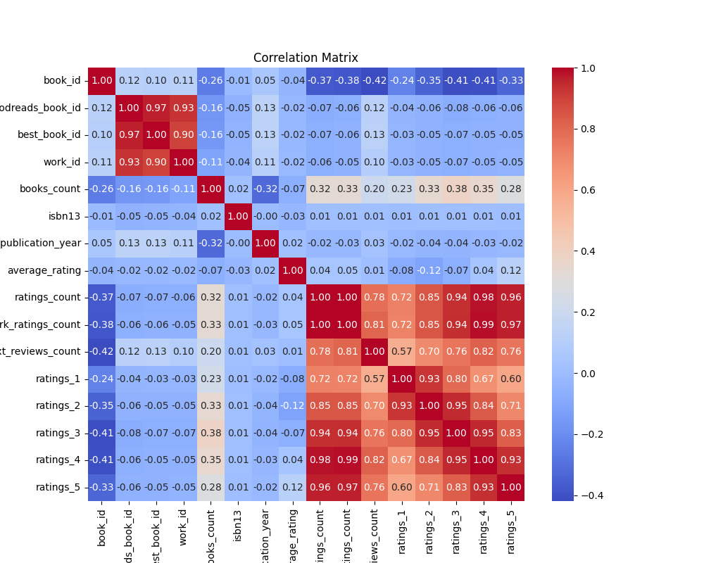
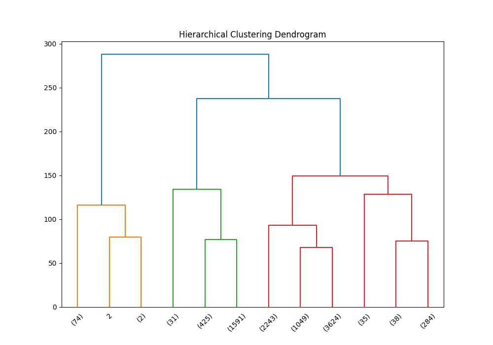
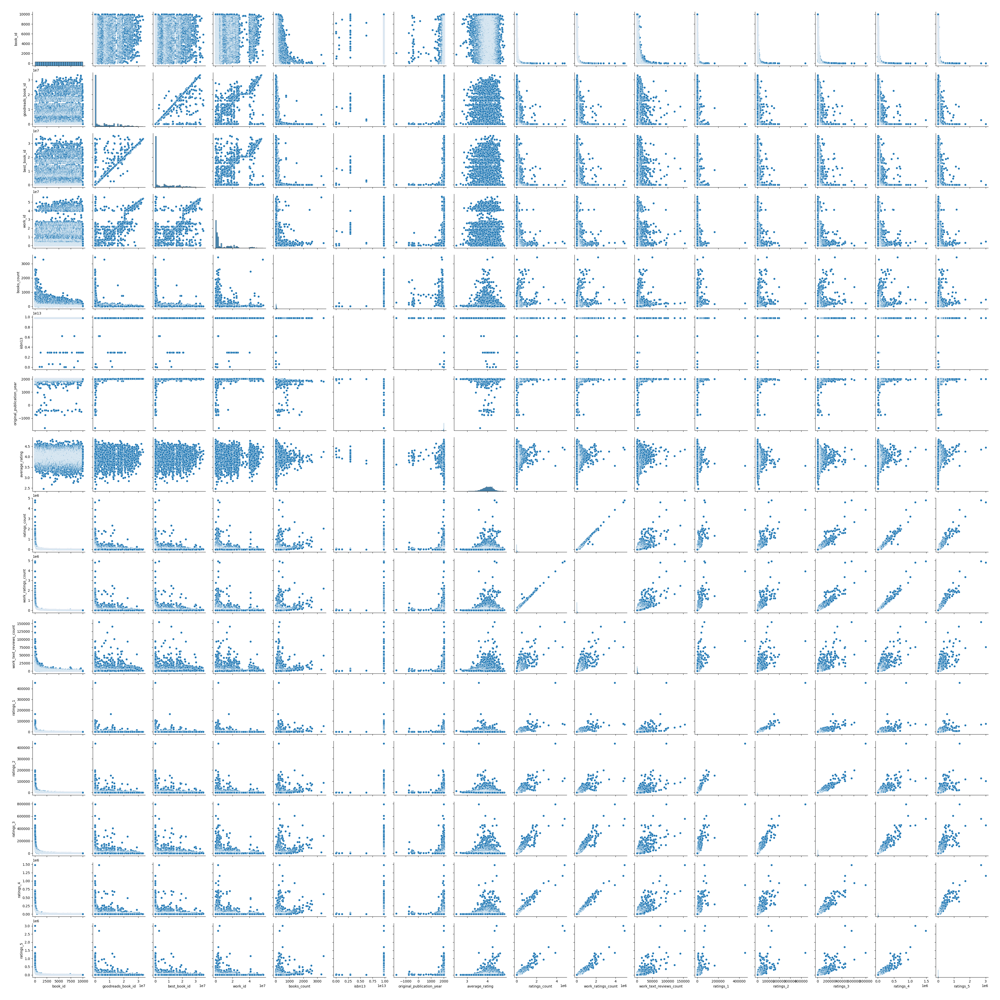

# Dataset Analysis Report
## CSV File Name: goodreads.csv
## Dataset Overview
- **Shape:** 10000 rows and 23 columns
### Columns and Data Types:
```plaintext
book_id                        int64
goodreads_book_id              int64
best_book_id                   int64
work_id                        int64
books_count                    int64
isbn                          object
isbn13                       float64
authors                       object
original_publication_year    float64
original_title                object
title                         object
language_code                 object
average_rating               float64
ratings_count                  int64
work_ratings_count             int64
work_text_reviews_count        int64
ratings_1                      int64
ratings_2                      int64
ratings_3                      int64
ratings_4                      int64
ratings_5                      int64
image_url                     object
small_image_url               object
```
### Sample Rows:
```plaintext
    book_id  goodreads_book_id  best_book_id   work_id  books_count        isbn        isbn13                                                 authors  original_publication_year                                                                        original_title                                                             title language_code  average_rating  ratings_count  work_ratings_count  work_text_reviews_count  ratings_1  ratings_2  ratings_3  ratings_4  ratings_5                                                                                 image_url                                                                         small_image_url
0         1            2767052       2767052   2792775          272   439023483  9.780439e+12                                         Suzanne Collins                     2008.0                                                                      The Hunger Games                           The Hunger Games (The Hunger Games, #1)           eng            4.34        4780653             4942365                   155254      66715     127936     560092    1481305    2706317                                https://images.gr-assets.com/books/1447303603m/2767052.jpg                              https://images.gr-assets.com/books/1447303603s/2767052.jpg
1         2                  3             3   4640799          491   439554934  9.780440e+12                             J.K. Rowling, Mary GrandPré                     1997.0                                              Harry Potter and the Philosopher's Stone          Harry Potter and the Sorcerer's Stone (Harry Potter, #1)           eng            4.44        4602479             4800065                    75867      75504     101676     455024    1156318    3011543                                      https://images.gr-assets.com/books/1474154022m/3.jpg                                    https://images.gr-assets.com/books/1474154022s/3.jpg
2         3              41865         41865   3212258          226   316015849  9.780316e+12                                         Stephenie Meyer                     2005.0                                                                              Twilight                                           Twilight (Twilight, #1)         en-US            3.57        3866839             3916824                    95009     456191     436802     793319     875073    1355439                                  https://images.gr-assets.com/books/1361039443m/41865.jpg                                https://images.gr-assets.com/books/1361039443s/41865.jpg
3         4               2657          2657   3275794          487    61120081  9.780061e+12                                              Harper Lee                     1960.0                                                                 To Kill a Mockingbird                                             To Kill a Mockingbird           eng            4.25        3198671             3340896                    72586      60427     117415     446835    1001952    1714267                                   https://images.gr-assets.com/books/1361975680m/2657.jpg                                 https://images.gr-assets.com/books/1361975680s/2657.jpg
4         5               4671          4671    245494         1356   743273567  9.780743e+12                                     F. Scott Fitzgerald                     1925.0                                                                      The Great Gatsby                                                  The Great Gatsby           eng            3.89        2683664             2773745                    51992      86236     197621     606158     936012     947718                                   https://images.gr-assets.com/books/1490528560m/4671.jpg                                 https://images.gr-assets.com/books/1490528560s/4671.jpg
5         6           11870085      11870085  16827462          226   525478817  9.780525e+12                                              John Green                     2012.0                                                                The Fault in Our Stars                                            The Fault in Our Stars           eng            4.26        2346404             2478609                   140739      47994      92723     327550     698471    1311871                               https://images.gr-assets.com/books/1360206420m/11870085.jpg                             https://images.gr-assets.com/books/1360206420s/11870085.jpg
6         7               5907          5907   1540236          969   618260307  9.780618e+12                                          J.R.R. Tolkien                     1937.0                                                    The Hobbit or There and Back Again                                                        The Hobbit         en-US            4.25        2071616             2196809                    37653      46023      76784     288649     665635    1119718                                   https://images.gr-assets.com/books/1372847500m/5907.jpg                                 https://images.gr-assets.com/books/1372847500s/5907.jpg
7         8               5107          5107   3036731          360   316769177  9.780317e+12                                           J.D. Salinger                     1951.0                                                                The Catcher in the Rye                                            The Catcher in the Rye           eng            3.79        2044241             2120637                    44920     109383     185520     455042     661516     709176                                   https://images.gr-assets.com/books/1398034300m/5107.jpg                                 https://images.gr-assets.com/books/1398034300s/5107.jpg
8         9                960           960   3338963          311  1416524797  9.781417e+12                                               Dan Brown                     2000.0                                                                      Angels & Demons                              Angels & Demons  (Robert Langdon, #1)         en-CA            3.85        2001311             2078754                    25112      77841     145740     458429     716569     680175                                    https://images.gr-assets.com/books/1303390735m/960.jpg                                  https://images.gr-assets.com/books/1303390735s/960.jpg
9        10               1885          1885   3060926         3455   679783261  9.780680e+12                                             Jane Austen                     1813.0                                                                   Pride and Prejudice                                               Pride and Prejudice           eng            4.24        2035490             2191465                    49152      54700      86485     284852     609755    1155673                                   https://images.gr-assets.com/books/1320399351m/1885.jpg                                 https://images.gr-assets.com/books/1320399351s/1885.jpg
10       11              77203         77203   3295919          283  1594480001  9.781594e+12                                         Khaled Hosseini                     2003.0                                                                      The Kite Runner                                                    The Kite Runner           eng            4.26        1813044             1878095                    59730      34288      59980     226062     628174     929591                                  https://images.gr-assets.com/books/1484565687m/77203.jpg                                https://images.gr-assets.com/books/1484565687s/77203.jpg
11       12           13335037      13335037  13155899          210    62024035  9.780062e+12                                           Veronica Roth                     2011.0                                                                             Divergent                                         Divergent (Divergent, #1)           eng            4.24        1903563             2216814                   101023      36315      82870     310297     673028    1114304                               https://images.gr-assets.com/books/1328559506m/13335037.jpg                             https://images.gr-assets.com/books/1328559506s/13335037.jpg
12       13               5470          5470    153313          995   451524934  9.780452e+12                 George Orwell, Erich Fromm, Celâl Üster                     1949.0                                                                  Nineteen Eighty-Four                                                              1984           eng            4.14        1956832             2053394                    45518      41845      86425     324874     692021     908229                                   https://images.gr-assets.com/books/1348990566m/5470.jpg                                 https://images.gr-assets.com/books/1348990566s/5470.jpg
13       14               7613          7613   2207778          896   452284244  9.780452e+12                                           George Orwell                     1945.0                                                            Animal Farm: A Fairy Story                                                       Animal Farm           eng            3.87        1881700             1982987                    35472      66854     135147     433432     698642     648912                                   https://images.gr-assets.com/books/1424037542m/7613.jpg                                 https://images.gr-assets.com/books/1424037542s/7613.jpg
14       15              48855         48855   3532896          710   553296981  9.780553e+12  Anne Frank, Eleanor Roosevelt, B.M. Mooyaart-Doubleday                     1947.0                         Het Achterhuis: Dagboekbrieven 14 juni 1942 - 1 augustus 1944                                         The Diary of a Young Girl           eng            4.10        1972666             2024493                    20825      45225      91270     355756     656870     875372                                  https://images.gr-assets.com/books/1358276407m/48855.jpg                                https://images.gr-assets.com/books/1358276407s/48855.jpg
15       16            2429135       2429135   1708725          274   307269752  9.780307e+12                              Stieg Larsson, Reg Keeland                     2005.0                                                                 Män som hatar kvinnor                  The Girl with the Dragon Tattoo (Millennium, #1)           eng            4.11        1808403             1929834                    62543      54835      86051     285413     667485     836050                                https://images.gr-assets.com/books/1327868566m/2429135.jpg                              https://images.gr-assets.com/books/1327868566s/2429135.jpg
16       17            6148028       6148028   6171458          201   439023491  9.780439e+12                                         Suzanne Collins                     2009.0                                                                         Catching Fire                              Catching Fire (The Hunger Games, #2)           eng            4.30        1831039             1988079                    88538      10492      48030     262010     687238     980309                                https://images.gr-assets.com/books/1358273780m/6148028.jpg                              https://images.gr-assets.com/books/1358273780s/6148028.jpg
17       18                  5             5   2402163          376  043965548X  9.780440e+12                 J.K. Rowling, Mary GrandPré, Rufus Beck                     1999.0                                              Harry Potter and the Prisoner of Azkaban       Harry Potter and the Prisoner of Azkaban (Harry Potter, #3)           eng            4.53        1832823             1969375                    36099       6716      20413     166129     509447    1266670                                      https://images.gr-assets.com/books/1499277281m/5.jpg                                    https://images.gr-assets.com/books/1499277281s/5.jpg
18       19                 34            34   3204327          566   618346252  9.780618e+12                                          J.R.R. Tolkien                     1954.0                                                            The Fellowship of the Ring            The Fellowship of the Ring (The Lord of the Rings, #1)           eng            4.34        1766803             1832541                    15333      38031      55862     202332     493922    1042394                                     https://images.gr-assets.com/books/1298411339m/34.jpg                                   https://images.gr-assets.com/books/1298411339s/34.jpg
19       20            7260188       7260188   8812783          239   439023513  9.780439e+12                                         Suzanne Collins                     2010.0                                                                            Mockingjay                                 Mockingjay (The Hunger Games, #3)           eng            4.03        1719760             1870748                    96274      30144     110498     373060     618271     738775                                https://images.gr-assets.com/books/1358275419m/7260188.jpg                              https://images.gr-assets.com/books/1358275419s/7260188.jpg
20       21                  2             2   2809203          307   439358078  9.780439e+12                             J.K. Rowling, Mary GrandPré                     2003.0                                             Harry Potter and the Order of the Phoenix      Harry Potter and the Order of the Phoenix (Harry Potter, #5)           eng            4.46        1735368             1840548                    28685       9528      31577     180210     494427    1124806                                      https://images.gr-assets.com/books/1387141547m/2.jpg                                    https://images.gr-assets.com/books/1387141547s/2.jpg
21       22           12232938      12232938   1145090          183   316166685  9.780316e+12                                            Alice Sebold                     2002.0                                                                      The Lovely Bones                                                  The Lovely Bones           eng            3.77        1605173             1661562                    36642      62777     131188     404699     583575     479323                               https://images.gr-assets.com/books/1457810586m/12232938.jpg                             https://images.gr-assets.com/books/1457810586s/12232938.jpg
22       23              15881         15881   6231171          398   439064864  9.780439e+12                             J.K. Rowling, Mary GrandPré                     1998.0                                               Harry Potter and the Chamber of Secrets        Harry Potter and the Chamber of Secrets (Harry Potter, #2)           eng            4.37        1779331             1906199                    34172       8253      42251     242345     548266    1065084                                  https://images.gr-assets.com/books/1474169725m/15881.jpg                                https://images.gr-assets.com/books/1474169725s/15881.jpg
23       24                  6             6   3046572          332   439139600  9.780439e+12                             J.K. Rowling, Mary GrandPré                     2000.0                                                   Harry Potter and the Goblet of Fire            Harry Potter and the Goblet of Fire (Harry Potter, #4)           eng            4.53        1753043             1868642                    31084       6676      20210     151785     494926    1195045                                      https://images.gr-assets.com/books/1361482611m/6.jpg                                    https://images.gr-assets.com/books/1361482611s/6.jpg
24       25             136251        136251   2963218          263   545010225  9.780545e+12                             J.K. Rowling, Mary GrandPré                     2007.0                                                  Harry Potter and the Deathly Hallows           Harry Potter and the Deathly Hallows (Harry Potter, #7)           eng            4.61        1746574             1847395                    51942       9363      22245     113646     383914    1318227                                 https://images.gr-assets.com/books/1474171184m/136251.jpg                               https://images.gr-assets.com/books/1474171184s/136251.jpg
25       26                968           968   2982101          350   307277674  9.780307e+12                                               Dan Brown                     2003.0                                                                     The Da Vinci Code                            The Da Vinci Code (Robert Langdon, #2)           eng            3.79        1447148             1557292                    41560      71345     126493     340790     539277     479387                                    https://images.gr-assets.com/books/1303252999m/968.jpg                                  https://images.gr-assets.com/books/1303252999s/968.jpg
26       27                  1             1  41335427          275   439785960  9.780440e+12                             J.K. Rowling, Mary GrandPré                     2005.0                                                Harry Potter and the Half-Blood Prince         Harry Potter and the Half-Blood Prince (Harry Potter, #6)           eng            4.54        1678823             1785676                    27520       7308      21516     136333     459028    1161491                                      https://images.gr-assets.com/books/1361039191m/1.jpg                                    https://images.gr-assets.com/books/1361039191s/1.jpg
27       28               7624          7624   2766512          458   140283331  9.780140e+12                                         William Golding                     1954.0                                                                    Lord of the Flies                                                  Lord of the Flies           eng            3.64        1605019             1671484                    26886      92779     160295     425648     564916     427846                                   https://images.gr-assets.com/books/1327869409m/7624.jpg                                 https://images.gr-assets.com/books/1327869409s/7624.jpg
28       29              18135         18135   3349450         1937   743477111  9.780743e+12           William Shakespeare, Robert           Jackson                     1595.0                                   An Excellent conceited Tragedie of Romeo and Juliet                                                  Romeo and Juliet           eng            3.73        1628519             1672889                    14778      57980     153179     452673     519822     489235                                  https://images.gr-assets.com/books/1327872146m/18135.jpg                                https://images.gr-assets.com/books/1327872146s/18135.jpg
29       30            8442457      19288043  13306276          196   297859382  9.780298e+12                                           Gillian Flynn                     2012.0                                                                             Gone Girl                                                         Gone Girl           eng            4.03         512475             1626519                   121614      38874      80807     280331     616031     610476                                https://images.gr-assets.com/books/1339602131m/8442457.jpg                              https://images.gr-assets.com/books/1339602131s/8442457.jpg
30       31            4667024       4667024   4717423          183   399155341  9.780399e+12                                        Kathryn Stockett                     2009.0                                                                              The Help                                                          The Help           eng            4.45        1531753             1603545                    78204      10235      25117     134887     490754     942552                                https://images.gr-assets.com/books/1346100365m/4667024.jpg                              https://images.gr-assets.com/books/1346100365s/4667024.jpg
31       32                890           890     40283          373   142000671  9.780142e+12                                          John Steinbeck                     1937.0                                                                      Of Mice and Men                                                    Of Mice and Men           eng            3.84        1467496             1518741                    24642      46630     110856     355169     532291     473795                                    https://images.gr-assets.com/books/1437235233m/890.jpg                                  https://images.gr-assets.com/books/1437235233s/890.jpg
32       33                930           929   1558965          220   739326228  9.780739e+12                                           Arthur Golden                     1997.0                                                                   Memoirs of a Geisha                                               Memoirs of a Geisha           eng            4.08        1300209             1418172                    25605      23500      59033     258700     517157     559782  https://s.gr-assets.com/assets/nophoto/book/111x148-bcc042a9c91a29c1d680899eff700a03.png  https://s.gr-assets.com/assets/nophoto/book/50x75-a91bf249278a81aabab721ef782c4a74.png
33       34           10818853      10818853  15732562          169  1612130291  9.781612e+12                                              E.L. James                     2011.0                                                                  Fifty Shades of Grey                           Fifty Shades of Grey (Fifty Shades, #1)           eng            3.67        1338493             1436818                    75437     165455     152293     252185     294976     571909                               https://images.gr-assets.com/books/1385207843m/10818853.jpg                             https://images.gr-assets.com/books/1385207843s/10818853.jpg
34       35                865           865   4835472          458    61122416  9.780061e+12                            Paulo Coelho, Alan R. Clarke                     1988.0                                                                          O Alquimista                                                     The Alchemist           eng            3.82        1299566             1403995                    55781      74846     123614     289143     412180     504212                                    https://images.gr-assets.com/books/1483412266m/865.jpg                                  https://images.gr-assets.com/books/1483412266s/865.jpg
35       36               3636          3636   2543234          192   385732554  9.780386e+12                                              Lois Lowry                     1993.0                                                                             The Giver                                         The Giver (The Giver, #1)           eng            4.12        1296825             1345445                    54084      26497      59652     225326     448691     585279                                   https://images.gr-assets.com/books/1342493368m/3636.jpg                                 https://images.gr-assets.com/books/1342493368s/3636.jpg
36       37             100915        100915   4790821          474    60764899  9.780061e+12                                              C.S. Lewis                     1950.0                                                  The Lion, the Witch and the Wardrobe  The Lion, the Witch, and the Wardrobe (Chronicles of Narnia, #1)           eng            4.19        1531800             1584884                    15186      19309      55542     262038     513366     734629                                 https://images.gr-assets.com/books/1353029077m/100915.jpg                               https://images.gr-assets.com/books/1353029077s/100915.jpg
37       38              14050      18619684   2153746          167   965818675  9.780966e+12                                      Audrey Niffenegger                     2003.0                                                              The Time Traveler's Wife                                          The Time Traveler's Wife           eng            3.95         746287             1308667                    43382      44339      85429     257805     427210     493884                                  https://images.gr-assets.com/books/1437728815m/14050.jpg                                https://images.gr-assets.com/books/1437728815s/14050.jpg
38       39              13496         13496   1466917          101   553588486  9.780554e+12                                      George R.R. Martin                     1996.0                                                                     A Game of Thrones                    A Game of Thrones (A Song of Ice and Fire, #1)           eng            4.45        1319204             1442220                    46205      19988      28983     114092     404583     874574                                  https://images.gr-assets.com/books/1436732693m/13496.jpg                                https://images.gr-assets.com/books/1436732693s/13496.jpg
39       40              19501         19501   3352398          185   143038419  9.780143e+12                                       Elizabeth Gilbert                     2006.0  Eat, pray, love: one woman's search for everything across Italy, India and Indonesia                                                   Eat, Pray, Love           eng            3.51        1181647             1206597                    49714     100373     149549     310212     332191     314272                                  https://images.gr-assets.com/books/1503066414m/19501.jpg                                https://images.gr-assets.com/books/1503066414s/19501.jpg
40       41              28187         28187   3346751          159   786838655  9.780787e+12                                            Rick Riordan                     2005.0                                                                   The Lightning Thief         The Lightning Thief (Percy Jackson and the Olympians, #1)           eng            4.23        1366265             1411114                    46006      18303      48294     219638     435514     689365                                  https://images.gr-assets.com/books/1400602609m/28187.jpg                                https://images.gr-assets.com/books/1400602609s/28187.jpg
41       42               1934          1934   3244642         1707   451529308  9.780452e+12                                       Louisa May Alcott                     1868.0                                                                          Little Women                                   Little Women (Little Women, #1)         en-US            4.04        1257121             1314293                    17090      31645      70011     250794     426280     535563  https://s.gr-assets.com/assets/nophoto/book/111x148-bcc042a9c91a29c1d680899eff700a03.png  https://s.gr-assets.com/assets/nophoto/book/50x75-a91bf249278a81aabab721ef782c4a74.png
42       43              10210         10210   2977639         2568   142437204  9.780142e+12                         Charlotte Brontë, Michael Mason                     1847.0                                                                             Jane Eyre                                                         Jane Eyre           eng            4.10        1198557             1286135                    31212      35132      64274     212294     400214     574221                                  https://images.gr-assets.com/books/1327867269m/10210.jpg                                https://images.gr-assets.com/books/1327867269s/10210.jpg
43       44              15931         15931   1498135          190   553816713  9.780554e+12                                         Nicholas Sparks                     1996.0                                                                          The Notebook                                   The Notebook (The Notebook, #1)           eng            4.06        1053403             1076749                    17279      41395      63432     176469     298259     497194                                  https://images.gr-assets.com/books/1385738917m/15931.jpg                                https://images.gr-assets.com/books/1385738917s/15931.jpg
44       45               4214          4214   1392700          264   770430074  9.780770e+12                                             Yann Martel                     2001.0                                                                            Life of Pi                                                        Life of Pi           NaN            3.88        1003228             1077431                    42962      39768      74331     218702     384164     360466                                   https://images.gr-assets.com/books/1320562005m/4214.jpg                                 https://images.gr-assets.com/books/1320562005s/4214.jpg
45       46              43641         43641   3441236          128  1565125606  9.781565e+12                                              Sara Gruen                     2006.0                                                                   Water for Elephants                                               Water for Elephants           eng            4.07        1068146             1108839                    55732      16705      49832     200154     417328     424820                                  https://images.gr-assets.com/books/1494428973m/43641.jpg                                https://images.gr-assets.com/books/1494428973s/43641.jpg
46       47              19063         19063    878368          251   375831002  9.780376e+12                                            Markus Zusak                     2005.0                                                                        The Book Thief                                                    The Book Thief           eng            4.36        1159741             1287798                    93611      17892      35360     135272     377218     722056                                  https://images.gr-assets.com/books/1390053681m/19063.jpg                                https://images.gr-assets.com/books/1390053681s/19063.jpg
47       48               4381          4381   1272463          507   307347974  9.780307e+12                                            Ray Bradbury                     1953.0                                                                        Fahrenheit 451                                                    Fahrenheit 451           spa            3.97         570498             1176240                    30694      28366      64289     238242     426292     419051                                   https://images.gr-assets.com/books/1351643740m/4381.jpg                                 https://images.gr-assets.com/books/1351643740s/4381.jpg
48       49              49041         49041   3203964          194   316160199  9.780316e+12                                         Stephenie Meyer                     2006.0                                                               New Moon (Twilight, #2)                                           New Moon (Twilight, #2)           eng            3.52        1149630             1199000                    44020     102837     160660     294207     290612     350684                                  https://images.gr-assets.com/books/1361039440m/49041.jpg                                https://images.gr-assets.com/books/1361039440s/49041.jpg
49       50              30119         30119     30518           45    60513039  9.780061e+12                                        Shel Silverstein                     1974.0                   Where the Sidewalk Ends: The Poems and Drawings of Shel Silverstein                                           Where the Sidewalk Ends           eng            4.29        1016888             1023781                     9234      16590      30792     139024     293222     544153                                  https://images.gr-assets.com/books/1168052448m/30119.jpg                                https://images.gr-assets.com/books/1168052448s/30119.jpg
```
## Basic Statistics
```plaintext
            book_id  goodreads_book_id  best_book_id       work_id   books_count       isbn        isbn13       authors  original_publication_year original_title           title language_code  average_rating  ratings_count  work_ratings_count  work_text_reviews_count      ratings_1      ratings_2      ratings_3     ratings_4     ratings_5                                                                                 image_url                                                                         small_image_url
count   10000.00000       1.000000e+04  1.000000e+04  1.000000e+04  10000.000000       9300  9.415000e+03         10000                9979.000000           9415           10000          8916    10000.000000   1.000000e+04        1.000000e+04             10000.000000   10000.000000   10000.000000   10000.000000  1.000000e+04  1.000000e+04                                                                                     10000                                                                                   10000
unique          NaN                NaN           NaN           NaN           NaN       9300           NaN          4664                        NaN           9274            9964            25             NaN            NaN                 NaN                      NaN            NaN            NaN            NaN           NaN           NaN                                                                                      6669                                                                                    6669
top             NaN                NaN           NaN           NaN           NaN  439023483           NaN  Stephen King                        NaN                 Selected Poems           eng             NaN            NaN                 NaN                      NaN            NaN            NaN            NaN           NaN           NaN  https://s.gr-assets.com/assets/nophoto/book/111x148-bcc042a9c91a29c1d680899eff700a03.png  https://s.gr-assets.com/assets/nophoto/book/50x75-a91bf249278a81aabab721ef782c4a74.png
freq            NaN                NaN           NaN           NaN           NaN          1           NaN            60                        NaN              5               4          6341             NaN            NaN                 NaN                      NaN            NaN            NaN            NaN           NaN           NaN                                                                                      3332                                                                                    3332
mean     5000.50000       5.264697e+06  5.471214e+06  8.646183e+06     75.712700        NaN  9.755044e+12           NaN                1981.987674            NaN             NaN           NaN        4.002191   5.400124e+04        5.968732e+04              2919.955300    1345.040600    3110.885000   11475.893800  1.996570e+04  2.378981e+04                                                                                       NaN                                                                                     NaN
std      2886.89568       7.575462e+06  7.827330e+06  1.175106e+07    170.470728        NaN  4.428619e+11           NaN                 152.576665            NaN             NaN           NaN        0.254427   1.573700e+05        1.678038e+05              6124.378132    6635.626263    9717.123578   28546.449183  5.144736e+04  7.976889e+04                                                                                       NaN                                                                                     NaN
min         1.00000       1.000000e+00  1.000000e+00  8.700000e+01      1.000000        NaN  1.951703e+08           NaN               -1750.000000            NaN             NaN           NaN        2.470000   2.716000e+03        5.510000e+03                 3.000000      11.000000      30.000000     323.000000  7.500000e+02  7.540000e+02                                                                                       NaN                                                                                     NaN
25%      2500.75000       4.627575e+04  4.791175e+04  1.008841e+06     23.000000        NaN  9.780316e+12           NaN                1990.000000            NaN             NaN           NaN        3.850000   1.356875e+04        1.543875e+04               694.000000     196.000000     656.000000    3112.000000  5.405750e+03  5.334000e+03                                                                                       NaN                                                                                     NaN
50%      5000.50000       3.949655e+05  4.251235e+05  2.719524e+06     40.000000        NaN  9.780452e+12           NaN                2004.000000            NaN             NaN           NaN        4.020000   2.115550e+04        2.383250e+04              1402.000000     391.000000    1163.000000    4894.000000  8.269500e+03  8.836000e+03                                                                                       NaN                                                                                     NaN
75%      7500.25000       9.382225e+06  9.636112e+06  1.451775e+07     67.000000        NaN  9.780831e+12           NaN                2011.000000            NaN             NaN           NaN        4.180000   4.105350e+04        4.591500e+04              2744.250000     885.000000    2353.250000    9287.000000  1.602350e+04  1.730450e+04                                                                                       NaN                                                                                     NaN
max     10000.00000       3.328864e+07  3.553423e+07  5.639960e+07   3455.000000        NaN  9.790008e+12           NaN                2017.000000            NaN             NaN           NaN        4.820000   4.780653e+06        4.942365e+06            155254.000000  456191.000000  436802.000000  793319.000000  1.481305e+06  3.011543e+06                                                                                       NaN                                                                                     NaN
```
## Missing Values
```plaintext
isbn                          700
isbn13                        585
original_publication_year      21
original_title                585
language_code                1084
```
## Correlation Matrix
```plaintext
                            book_id  goodreads_book_id  best_book_id   work_id  books_count    isbn13  original_publication_year  average_rating  ratings_count  work_ratings_count  work_text_reviews_count  ratings_1  ratings_2  ratings_3  ratings_4  ratings_5
book_id                    1.000000           0.115154      0.104516  0.113861    -0.263841 -0.011291                   0.049875       -0.040880      -0.373178           -0.382656                -0.419292  -0.239401  -0.345764  -0.413279  -0.407079  -0.332486
goodreads_book_id          0.115154           1.000000      0.966620  0.929356    -0.164578 -0.048246                   0.133790       -0.024848      -0.073023           -0.063760                 0.118845  -0.038375  -0.056571  -0.075634  -0.063310  -0.056145
best_book_id               0.104516           0.966620      1.000000  0.899258    -0.159240 -0.047253                   0.131442       -0.021187      -0.069182           -0.055835                 0.125893  -0.033894  -0.049284  -0.067014  -0.054462  -0.049524
work_id                    0.113861           0.929356      0.899258  1.000000    -0.109436 -0.039320                   0.107972       -0.017555      -0.062720           -0.054712                 0.096985  -0.034590  -0.051367  -0.066746  -0.054775  -0.046745
books_count               -0.263841          -0.164578     -0.159240 -0.109436     1.000000  0.017865                  -0.321753       -0.069888       0.324235            0.333664                 0.198698   0.225763   0.334923   0.383699   0.349564   0.279559
isbn13                    -0.011291          -0.048246     -0.047253 -0.039320     0.017865  1.000000                  -0.004612       -0.025667       0.008904            0.009166                 0.009553   0.006054   0.010345   0.012142   0.010161   0.006622
original_publication_year  0.049875           0.133790      0.131442  0.107972    -0.321753 -0.004612                   1.000000        0.015608      -0.024415           -0.025448                 0.027784  -0.019635  -0.038472  -0.042459  -0.025785  -0.015388
average_rating            -0.040880          -0.024848     -0.021187 -0.017555    -0.069888 -0.025667                   0.015608        1.000000       0.044990            0.045042                 0.007481  -0.077997  -0.115875  -0.065237   0.036108   0.115412
ratings_count             -0.373178          -0.073023     -0.069182 -0.062720     0.324235  0.008904                  -0.024415        0.044990       1.000000            0.995068                 0.779635   0.723144   0.845949   0.935193   0.978869   0.964046
work_ratings_count        -0.382656          -0.063760     -0.055835 -0.054712     0.333664  0.009166                  -0.025448        0.045042       0.995068            1.000000                 0.807009   0.718718   0.848581   0.941182   0.987764   0.966587
work_text_reviews_count   -0.419292           0.118845      0.125893  0.096985     0.198698  0.009553                   0.027784        0.007481       0.779635            0.807009                 1.000000   0.572007   0.696880   0.762214   0.817826   0.764940
ratings_1                 -0.239401          -0.038375     -0.033894 -0.034590     0.225763  0.006054                  -0.019635       -0.077997       0.723144            0.718718                 0.572007   1.000000   0.926140   0.795364   0.672986   0.597231
ratings_2                 -0.345764          -0.056571     -0.049284 -0.051367     0.334923  0.010345                  -0.038472       -0.115875       0.845949            0.848581                 0.696880   0.926140   1.000000   0.949596   0.838298   0.705747
ratings_3                 -0.413279          -0.075634     -0.067014 -0.066746     0.383699  0.012142                  -0.042459       -0.065237       0.935193            0.941182                 0.762214   0.795364   0.949596   1.000000   0.952998   0.825550
ratings_4                 -0.407079          -0.063310     -0.054462 -0.054775     0.349564  0.010161                  -0.025785        0.036108       0.978869            0.987764                 0.817826   0.672986   0.838298   0.952998   1.000000   0.933785
ratings_5                 -0.332486          -0.056145     -0.049524 -0.046745     0.279559  0.006622                  -0.015388        0.115412       0.964046            0.966587                 0.764940   0.597231   0.705747   0.825550   0.933785   1.000000
```

## Outlier Detection
- **book_id:** 0 outliers
- **goodreads_book_id:** 345 outliers
- **best_book_id:** 357 outliers
- **work_id:** 601 outliers
- **books_count:** 844 outliers
- **isbn13:** 556 outliers
- **original_publication_year:** 1031 outliers
- **average_rating:** 158 outliers
- **ratings_count:** 1163 outliers
- **work_ratings_count:** 1143 outliers
- **work_text_reviews_count:** 1005 outliers
- **ratings_1:** 1140 outliers
- **ratings_2:** 1156 outliers
- **ratings_3:** 1149 outliers
- **ratings_4:** 1131 outliers
- **ratings_5:** 1158 outliers
## Clustering Analysis
Cluster Labels:
| Cluster | Count |
|---------|-------|
| 0.0 | 7193 |
| 1.0 | 2122 |
| 2.0 | 82 |

## Categorical Data Analysis
### Unique Value Count for All Categorical Columns
| Column | Unique Value Count |
|---------|--------------------|
| isbn | 9300 |
| authors | 4664 |
| original_title | 9274 |
| title | 9964 |
| language_code | 25 |
| image_url | 6669 |
| small_image_url | 6669 |

## Hierarchical Clustering

## Visualizations

Skipping distribution plot for book_id because it has 10000 distinct values.
Skipping distribution plot for goodreads_book_id because it has 10000 distinct values.
Skipping distribution plot for best_book_id because it has 10000 distinct values.
Skipping distribution plot for work_id because it has 10000 distinct values.
Skipping distribution plot for books_count because it has 597 distinct values.
Skipping distribution plot for isbn13 because it has 9153 distinct values.
Skipping distribution plot for original_publication_year because it has 293 distinct values.
Skipping distribution plot for average_rating because it has 184 distinct values.
Skipping distribution plot for ratings_count because it has 9003 distinct values.
Skipping distribution plot for work_ratings_count because it has 9053 distinct values.
Skipping distribution plot for work_text_reviews_count because it has 4581 distinct values.
Skipping distribution plot for ratings_1 because it has 2630 distinct values.
Skipping distribution plot for ratings_2 because it has 4117 distinct values.
Skipping distribution plot for ratings_3 because it has 6972 distinct values.
Skipping distribution plot for ratings_4 because it has 7762 distinct values.
Skipping distribution plot for ratings_5 because it has 8103 distinct values.
## Hierarchical Clustering
