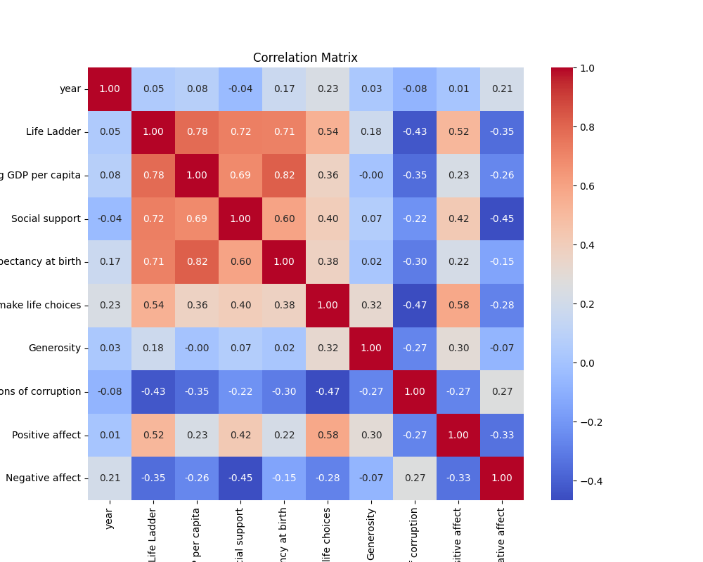
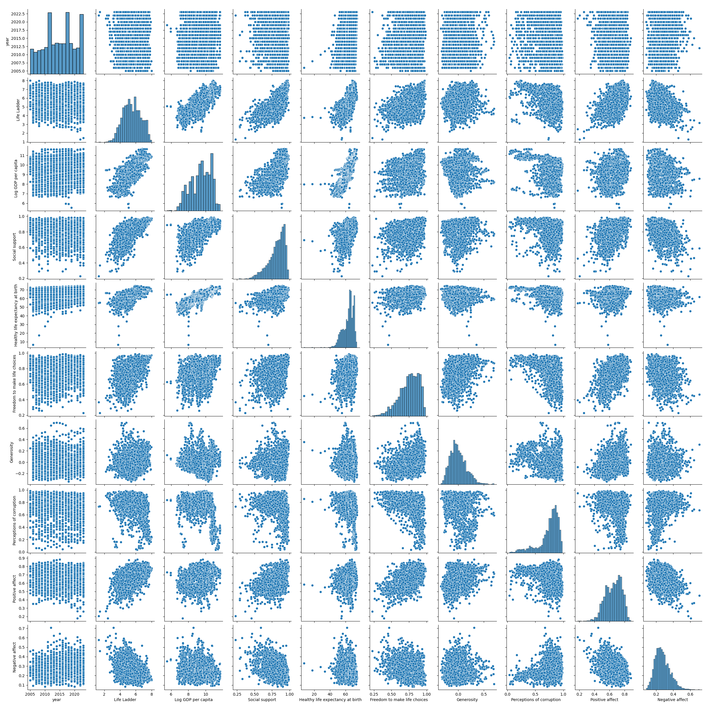
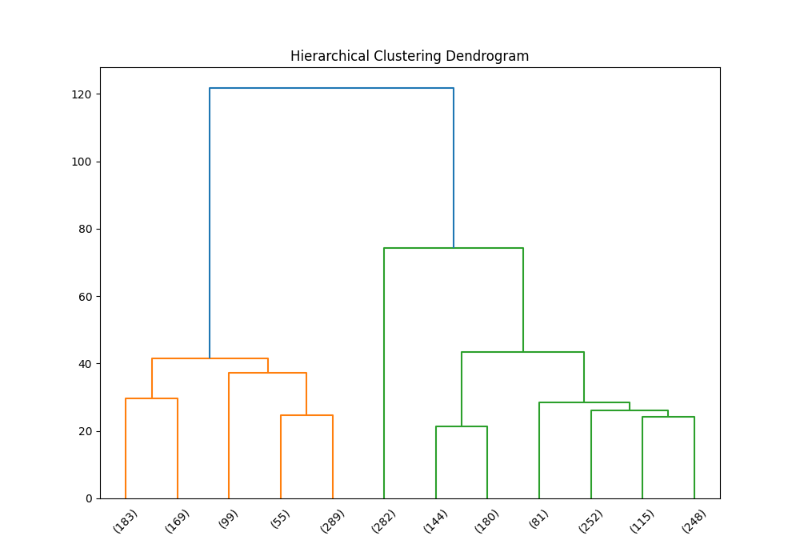

# Dataset Analysis Report

## CSV File Name: happiness.csv

## Dataset Overview

- **Shape:** 2363 rows and 11 columns

### Columns and Data Types:

```plaintext
Country name                         object
year                                  int64
Life Ladder                         float64
Log GDP per capita                  float64
Social support                      float64
Healthy life expectancy at birth    float64
Freedom to make life choices        float64
Generosity                          float64
Perceptions of corruption           float64
Positive affect                     float64
Negative affect                     float64
```

### Sample Rows:

```plaintext
  Country name  year  Life Ladder  Log GDP per capita  Social support  Healthy life expectancy at birth  Freedom to make life choices  Generosity  Perceptions of corruption  Positive affect  Negative affect
0  Afghanistan  2008        3.724               7.350           0.451                              50.5                         0.718       0.164                      0.882            0.414            0.258
1  Afghanistan  2009        4.402               7.509           0.552                              50.8                         0.679       0.187                      0.850            0.481            0.237
2  Afghanistan  2010        4.758               7.614           0.539                              51.1                         0.600       0.118                      0.707            0.517            0.275
3  Afghanistan  2011        3.832               7.581           0.521                              51.4                         0.496       0.160                      0.731            0.480            0.267
4  Afghanistan  2012        3.783               7.661           0.521                              51.7                         0.531       0.234                      0.776            0.614            0.268
```

## Basic Statistics

```plaintext
       Country name         year  Life Ladder  Log GDP per capita  Social support  Healthy life expectancy at birth  Freedom to make life choices   Generosity  Perceptions of corruption  Positive affect  Negative affect
count          2363  2363.000000  2363.000000         2335.000000     2350.000000                       2300.000000                   2327.000000  2282.000000                2238.000000      2339.000000      2347.000000
unique          165          NaN          NaN                 NaN             NaN                               NaN                           NaN          NaN                        NaN              NaN              NaN
top         Lebanon          NaN          NaN                 NaN             NaN                               NaN                           NaN          NaN                        NaN              NaN              NaN
freq             18          NaN          NaN                 NaN             NaN                               NaN                           NaN          NaN                        NaN              NaN              NaN
mean            NaN  2014.763860     5.483566            9.399671        0.809369                         63.401828                      0.750282     0.000098                   0.743971         0.651882         0.273151
std             NaN     5.059436     1.125522            1.152069        0.121212                          6.842644                      0.139357     0.161388                   0.184865         0.106240         0.087131
min             NaN  2005.000000     1.281000            5.527000        0.228000                          6.720000                      0.228000    -0.340000                   0.035000         0.179000         0.083000
25%             NaN  2011.000000     4.647000            8.506500        0.744000                         59.195000                      0.661000    -0.112000                   0.687000         0.572000         0.209000
50%             NaN  2015.000000     5.449000            9.503000        0.834500                         65.100000                      0.771000    -0.022000                   0.798500         0.663000         0.262000
75%             NaN  2019.000000     6.323500           10.392500        0.904000                         68.552500                      0.862000     0.093750                   0.867750         0.737000         0.326000
max             NaN  2023.000000     8.019000           11.676000        0.987000                         74.600000                      0.985000     0.700000                   0.983000         0.884000         0.705000
```

## Missing Values

```plaintext
Log GDP per capita                   28
Social support                       13
Healthy life expectancy at birth     63
Freedom to make life choices         36
Generosity                           81
Perceptions of corruption           125
Positive affect                      24
Negative affect                      16
```

## Correlation Matrix

```plaintext
                                      year  Life Ladder  Log GDP per capita  Social support  Healthy life expectancy at birth  Freedom to make life choices  Generosity  Perceptions of corruption  Positive affect  Negative affect
year                              1.000000     0.046846            0.080104       -0.043074                          0.168026                      0.232974    0.030864                  -0.082136         0.013052         0.207642
Life Ladder                       0.046846     1.000000            0.783556        0.722738                          0.714927                      0.538210    0.177398                  -0.430485         0.515283        -0.352412
Log GDP per capita                0.080104     0.783556            1.000000        0.685329                          0.819326                      0.364816   -0.000766                  -0.353893         0.230868        -0.260689
Social support                   -0.043074     0.722738            0.685329        1.000000                          0.597787                      0.404131    0.065240                  -0.221410         0.424524        -0.454878
Healthy life expectancy at birth  0.168026     0.714927            0.819326        0.597787                          1.000000                      0.375745    0.015168                  -0.303130         0.217982        -0.150330
Freedom to make life choices      0.232974     0.538210            0.364816        0.404131                          0.375745                      1.000000    0.321396                  -0.466023         0.578398        -0.278959
Generosity                        0.030864     0.177398           -0.000766        0.065240                          0.015168                      0.321396    1.000000                  -0.270004         0.300608        -0.071975
Perceptions of corruption        -0.082136    -0.430485           -0.353893       -0.221410                         -0.303130                     -0.466023   -0.270004                   1.000000        -0.274208         0.265555
Positive affect                   0.013052     0.515283            0.230868        0.424524                          0.217982                      0.578398    0.300608                  -0.274208         1.000000        -0.334451
Negative affect                   0.207642    -0.352412           -0.260689       -0.454878                         -0.150330                     -0.278959   -0.071975                   0.265555        -0.334451         1.000000
```



## Outlier Detection

- **year:** 0 outliers

- **Life Ladder:** 2 outliers

- **Log GDP per capita:** 1 outliers

- **Social support:** 48 outliers

- **Healthy life expectancy at birth:** 20 outliers

- **Freedom to make life choices:** 16 outliers

- **Generosity:** 39 outliers

- **Perceptions of corruption:** 194 outliers

- **Positive affect:** 9 outliers

- **Negative affect:** 31 outliers

## Clustering Analysis

Cluster Labels:

| Cluster | Count |
|---------|-------|
| 0.0 | 982 |
| 2.0 | 789 |
| 1.0 | 326 |


## Categorical Data Analysis

### Unique Value Count for All Categorical Columns

| Column | Unique Value Count |
|---------|--------------------|
| Country name | 165 |


## Visualizations



Skipping distribution plot for Country name because it has 165 distinct values.

## Hierarchical Clustering



## Generated Narrative