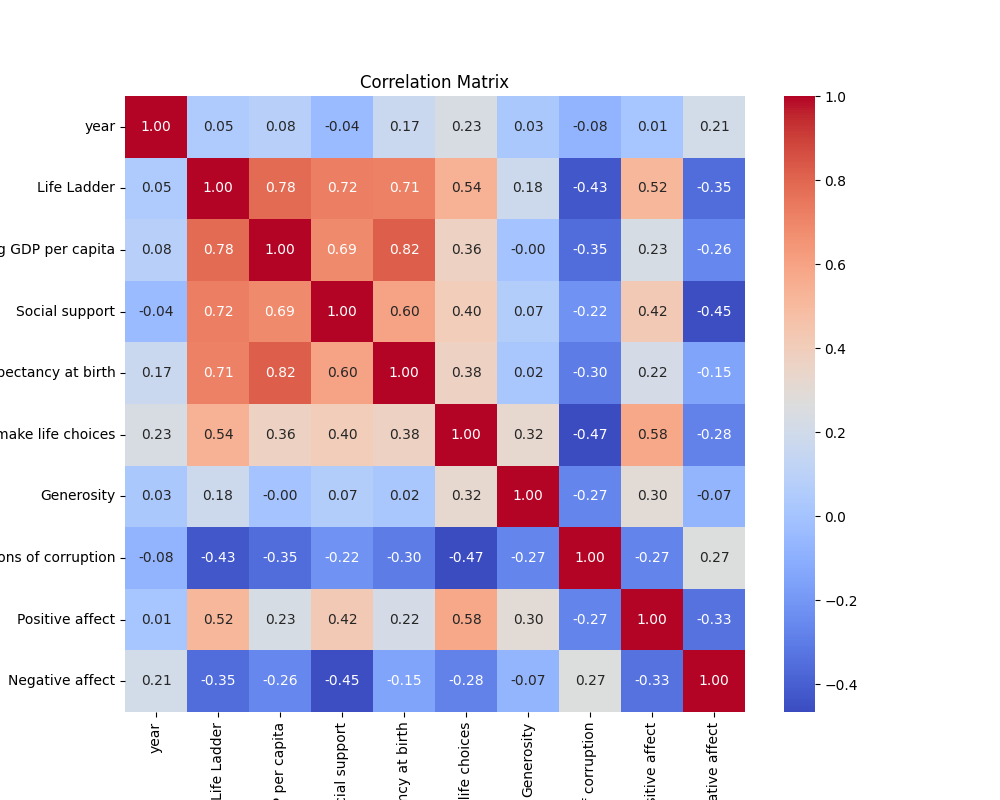
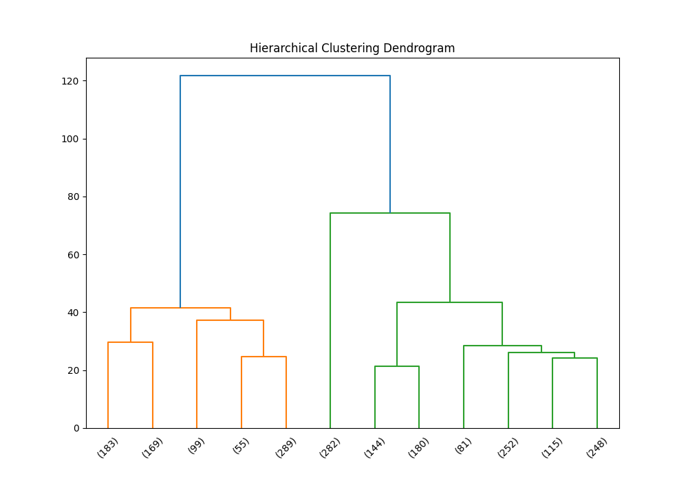
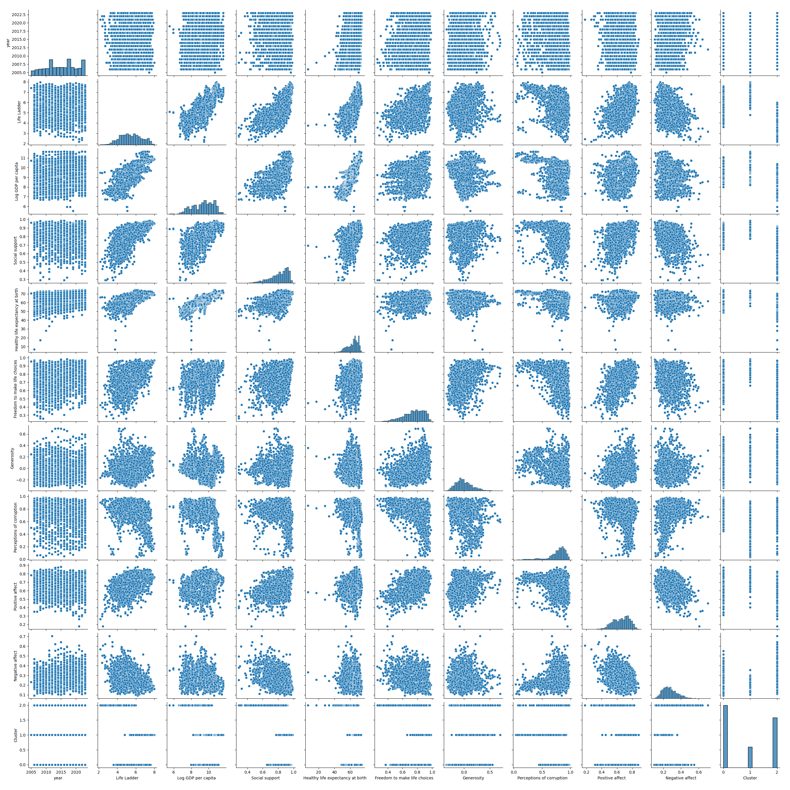

# Dataset Analysis Report
## CSV File Name: happiness.csv
## Dataset Overview
- **Shape:** 2363 rows and 11 columns
### Columns and Data Types:
```plaintext
Country name                         object
year                                  int64
Life Ladder                         float64
Log GDP per capita                  float64
Social support                      float64
Healthy life expectancy at birth    float64
Freedom to make life choices        float64
Generosity                          float64
Perceptions of corruption           float64
Positive affect                     float64
Negative affect                     float64
```
### Sample Rows:
```plaintext
   Country name  year  Life Ladder  Log GDP per capita  Social support  Healthy life expectancy at birth  Freedom to make life choices  Generosity  Perceptions of corruption  Positive affect  Negative affect
0   Afghanistan  2008        3.724               7.350           0.451                            50.500                         0.718       0.164                      0.882            0.414            0.258
1   Afghanistan  2009        4.402               7.509           0.552                            50.800                         0.679       0.187                      0.850            0.481            0.237
2   Afghanistan  2010        4.758               7.614           0.539                            51.100                         0.600       0.118                      0.707            0.517            0.275
3   Afghanistan  2011        3.832               7.581           0.521                            51.400                         0.496       0.160                      0.731            0.480            0.267
4   Afghanistan  2012        3.783               7.661           0.521                            51.700                         0.531       0.234                      0.776            0.614            0.268
5   Afghanistan  2013        3.572               7.680           0.484                            52.000                         0.578       0.059                      0.823            0.547            0.273
6   Afghanistan  2014        3.131               7.671           0.526                            52.300                         0.509       0.102                      0.871            0.492            0.375
7   Afghanistan  2015        3.983               7.654           0.529                            52.600                         0.389       0.078                      0.881            0.491            0.339
8   Afghanistan  2016        4.220               7.650           0.559                            52.925                         0.523       0.040                      0.793            0.501            0.348
9   Afghanistan  2017        2.662               7.648           0.491                            53.250                         0.427      -0.123                      0.954            0.435            0.371
10  Afghanistan  2018        2.694               7.631           0.508                            53.575                         0.374      -0.095                      0.928            0.385            0.405
11  Afghanistan  2019        2.375               7.640           0.420                            53.900                         0.394      -0.109                      0.924            0.324            0.502
12  Afghanistan  2021        2.436               7.325           0.454                            54.550                         0.394      -0.085                      0.946            0.179            0.607
13  Afghanistan  2022        1.281                 NaN           0.228                            54.875                         0.368         NaN                      0.733            0.206            0.576
14  Afghanistan  2023        1.446                 NaN           0.368                            55.200                         0.228         NaN                      0.738            0.261            0.460
15      Albania  2007        4.634               9.122           0.821                            66.760                         0.529      -0.013                      0.875            0.489            0.246
16      Albania  2009        5.485               9.241           0.833                            67.320                         0.525      -0.162                      0.864            0.564            0.279
17      Albania  2010        5.269               9.283           0.733                            67.600                         0.569      -0.176                      0.726            0.576            0.300
18      Albania  2011        5.867               9.310           0.759                            67.880                         0.487      -0.209                      0.877            0.566            0.257
19      Albania  2012        5.510               9.326           0.785                            68.160                         0.602      -0.173                      0.848            0.553            0.271
20      Albania  2013        4.551               9.338           0.759                            68.440                         0.632      -0.131                      0.863            0.541            0.338
21      Albania  2014        4.814               9.358           0.626                            68.720                         0.735      -0.029                      0.883            0.573            0.335
22      Albania  2015        4.607               9.382           0.639                            69.000                         0.704      -0.085                      0.885            0.579            0.350
23      Albania  2016        4.511               9.417           0.638                            69.025                         0.730      -0.021                      0.901            0.567            0.322
24      Albania  2017        4.640               9.455           0.638                            69.050                         0.750      -0.033                      0.876            0.547            0.334
25      Albania  2018        5.004               9.497           0.684                            69.075                         0.824       0.005                      0.899            0.592            0.319
26      Albania  2019        4.995               9.522           0.686                            69.100                         0.777      -0.103                      0.914            0.548            0.274
27      Albania  2020        5.365               9.494           0.710                            69.125                         0.754       0.002                      0.891            0.563            0.265
28      Albania  2021        5.255               9.588           0.702                            69.150                         0.827       0.039                      0.896            0.554            0.254
29      Albania  2022        5.212               9.649           0.724                            69.175                         0.802      -0.070                      0.846            0.547            0.255
30      Albania  2023        5.445               9.689           0.691                            69.200                         0.872       0.068                      0.855            0.597            0.314
31      Algeria  2010        5.464               9.306             NaN                            65.500                         0.593      -0.212                      0.618              NaN              NaN
32      Algeria  2011        5.317               9.316           0.810                            65.600                         0.530      -0.188                      0.638            0.503            0.255
33      Algeria  2012        5.605               9.330           0.839                            65.700                         0.587      -0.179                      0.690            0.540            0.230
34      Algeria  2014        6.355               9.355           0.818                            65.900                           NaN         NaN                        NaN            0.558            0.177
35      Algeria  2016        5.341               9.383           0.749                            66.100                           NaN         NaN                        NaN            0.565            0.377
36      Algeria  2017        5.249               9.377           0.807                            66.200                         0.437      -0.174                      0.700            0.555            0.289
37      Algeria  2018        5.043               9.370           0.799                            66.300                         0.583      -0.153                      0.759            0.534            0.293
38      Algeria  2019        4.745               9.361           0.803                            66.400                         0.385      -0.002                      0.741            0.544            0.215
39      Algeria  2020        5.438               9.291           0.868                            66.500                         0.574      -0.124                      0.724            0.524            0.311
40      Algeria  2021        5.217               9.308           0.841                            66.600                         0.558      -0.116                      0.712            0.498            0.258
41      Algeria  2022        5.538               9.323           0.783                            66.700                         0.440      -0.045                      0.611            0.583            0.259
42       Angola  2011        5.589               8.944           0.723                            51.220                         0.584       0.050                      0.911            0.667            0.361
43       Angola  2012        4.360               8.989           0.753                            51.840                         0.456      -0.141                      0.906            0.591            0.305
44       Angola  2013        3.937               9.000           0.722                            52.460                         0.410      -0.109                      0.816            0.650            0.371
45       Angola  2014        3.795               9.010           0.755                            53.080                         0.375      -0.173                      0.834            0.595            0.368
46    Argentina  2006        6.313               9.937           0.938                            65.820                         0.733      -0.162                      0.852            0.748            0.328
47    Argentina  2007        6.073              10.013           0.862                            65.940                         0.653      -0.146                      0.881            0.750            0.279
48    Argentina  2008        5.961              10.043           0.892                            66.060                         0.678      -0.137                      0.865            0.720            0.318
49    Argentina  2009        6.424               9.972           0.919                            66.180                         0.637      -0.135                      0.885            0.762            0.237
```
## Basic Statistics
```plaintext
       Country name         year  Life Ladder  Log GDP per capita  Social support  Healthy life expectancy at birth  Freedom to make life choices   Generosity  Perceptions of corruption  Positive affect  Negative affect
count          2363  2363.000000  2363.000000         2335.000000     2350.000000                       2300.000000                   2327.000000  2282.000000                2238.000000      2339.000000      2347.000000
unique          165          NaN          NaN                 NaN             NaN                               NaN                           NaN          NaN                        NaN              NaN              NaN
top         Lebanon          NaN          NaN                 NaN             NaN                               NaN                           NaN          NaN                        NaN              NaN              NaN
freq             18          NaN          NaN                 NaN             NaN                               NaN                           NaN          NaN                        NaN              NaN              NaN
mean            NaN  2014.763860     5.483566            9.399671        0.809369                         63.401828                      0.750282     0.000098                   0.743971         0.651882         0.273151
std             NaN     5.059436     1.125522            1.152069        0.121212                          6.842644                      0.139357     0.161388                   0.184865         0.106240         0.087131
min             NaN  2005.000000     1.281000            5.527000        0.228000                          6.720000                      0.228000    -0.340000                   0.035000         0.179000         0.083000
25%             NaN  2011.000000     4.647000            8.506500        0.744000                         59.195000                      0.661000    -0.112000                   0.687000         0.572000         0.209000
50%             NaN  2015.000000     5.449000            9.503000        0.834500                         65.100000                      0.771000    -0.022000                   0.798500         0.663000         0.262000
75%             NaN  2019.000000     6.323500           10.392500        0.904000                         68.552500                      0.862000     0.093750                   0.867750         0.737000         0.326000
max             NaN  2023.000000     8.019000           11.676000        0.987000                         74.600000                      0.985000     0.700000                   0.983000         0.884000         0.705000
```
## Missing Values
```plaintext
Log GDP per capita                   28
Social support                       13
Healthy life expectancy at birth     63
Freedom to make life choices         36
Generosity                           81
Perceptions of corruption           125
Positive affect                      24
Negative affect                      16
```
## Correlation Matrix
```plaintext
                                      year  Life Ladder  Log GDP per capita  Social support  Healthy life expectancy at birth  Freedom to make life choices  Generosity  Perceptions of corruption  Positive affect  Negative affect
year                              1.000000     0.046846            0.080104       -0.043074                          0.168026                      0.232974    0.030864                  -0.082136         0.013052         0.207642
Life Ladder                       0.046846     1.000000            0.783556        0.722738                          0.714927                      0.538210    0.177398                  -0.430485         0.515283        -0.352412
Log GDP per capita                0.080104     0.783556            1.000000        0.685329                          0.819326                      0.364816   -0.000766                  -0.353893         0.230868        -0.260689
Social support                   -0.043074     0.722738            0.685329        1.000000                          0.597787                      0.404131    0.065240                  -0.221410         0.424524        -0.454878
Healthy life expectancy at birth  0.168026     0.714927            0.819326        0.597787                          1.000000                      0.375745    0.015168                  -0.303130         0.217982        -0.150330
Freedom to make life choices      0.232974     0.538210            0.364816        0.404131                          0.375745                      1.000000    0.321396                  -0.466023         0.578398        -0.278959
Generosity                        0.030864     0.177398           -0.000766        0.065240                          0.015168                      0.321396    1.000000                  -0.270004         0.300608        -0.071975
Perceptions of corruption        -0.082136    -0.430485           -0.353893       -0.221410                         -0.303130                     -0.466023   -0.270004                   1.000000        -0.274208         0.265555
Positive affect                   0.013052     0.515283            0.230868        0.424524                          0.217982                      0.578398    0.300608                  -0.274208         1.000000        -0.334451
Negative affect                   0.207642    -0.352412           -0.260689       -0.454878                         -0.150330                     -0.278959   -0.071975                   0.265555        -0.334451         1.000000
```

## Outlier Detection
- **year:** 0 outliers
- **Life Ladder:** 2 outliers
- **Log GDP per capita:** 1 outliers
- **Social support:** 48 outliers
- **Healthy life expectancy at birth:** 20 outliers
- **Freedom to make life choices:** 16 outliers
- **Generosity:** 39 outliers
- **Perceptions of corruption:** 194 outliers
- **Positive affect:** 9 outliers
- **Negative affect:** 31 outliers
## Clustering Analysis
Cluster Labels:
| Cluster | Count |
|---------|-------|
| 0.0 | 982 |
| 2.0 | 789 |
| 1.0 | 326 |

## Categorical Data Analysis
### Unique Value Count for All Categorical Columns
| Column | Unique Value Count |
|---------|--------------------|
| Country name | 165 |

## Hierarchical Clustering

## Visualizations

Skipping distribution plot for Life Ladder because it has 1814 distinct values.
Skipping distribution plot for Log GDP per capita because it has 1760 distinct values.
Skipping distribution plot for Social support because it has 484 distinct values.
Skipping distribution plot for Healthy life expectancy at birth because it has 1126 distinct values.
Skipping distribution plot for Freedom to make life choices because it has 550 distinct values.
Skipping distribution plot for Generosity because it has 650 distinct values.
Skipping distribution plot for Perceptions of corruption because it has 613 distinct values.
Skipping distribution plot for Positive affect because it has 442 distinct values.
Skipping distribution plot for Negative affect because it has 394 distinct values.
## Hierarchical Clustering
