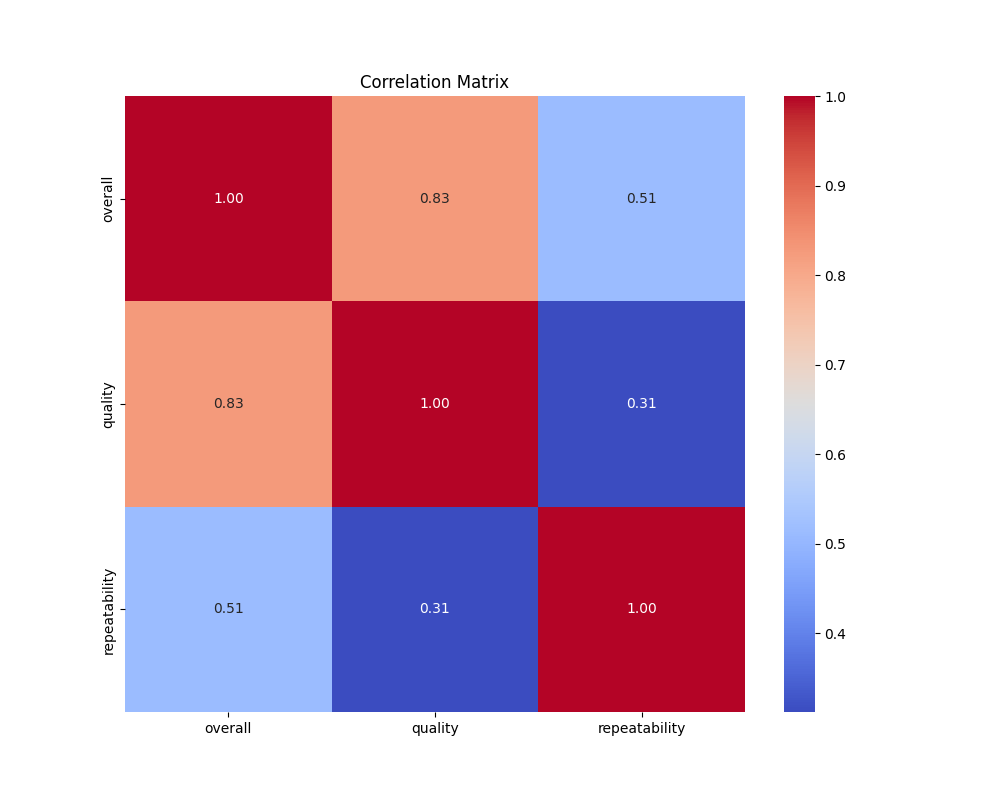
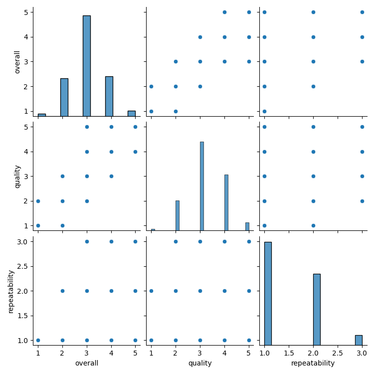
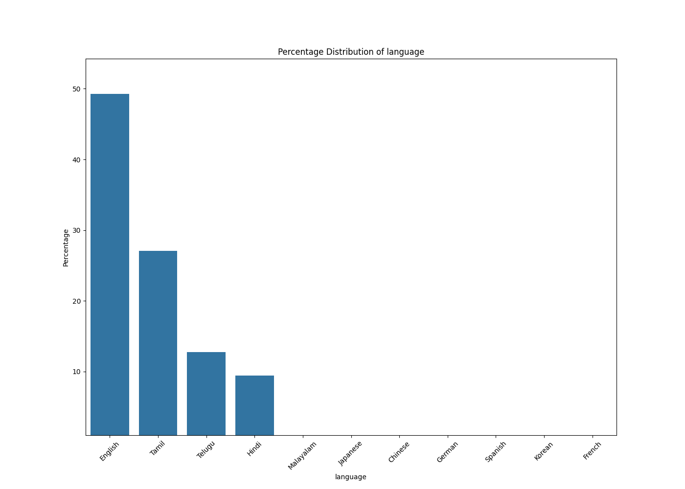
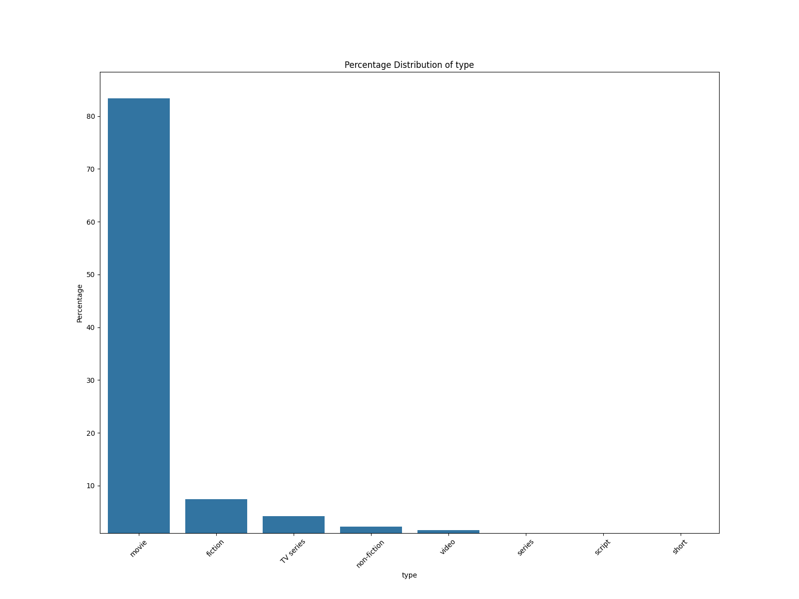
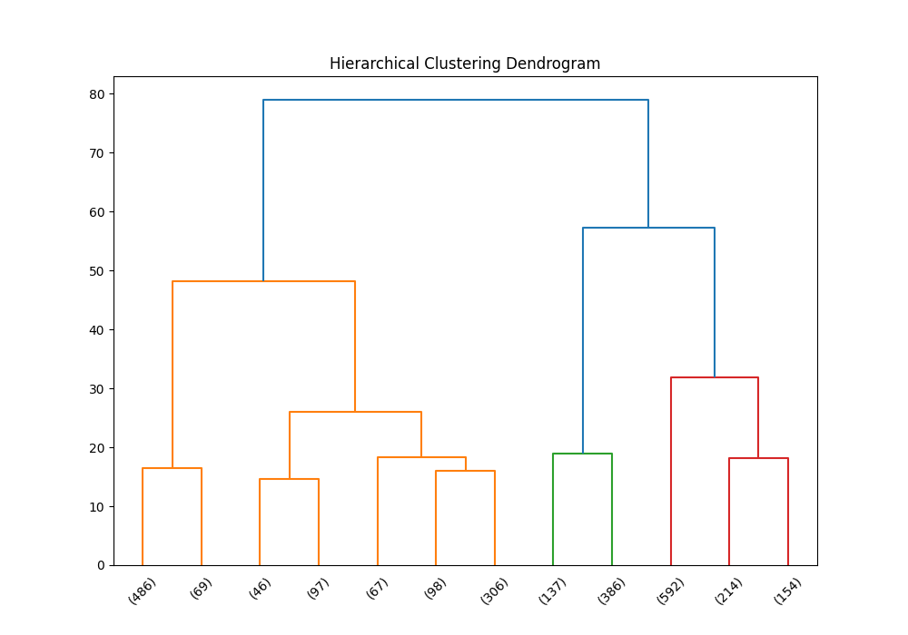

# Dataset Analysis Report

## CSV File Name: media.csv

## Dataset Overview

- **Shape:** 2652 rows and 8 columns

### Columns and Data Types:

```plaintext
date             object
language         object
type             object
title            object
by               object
overall           int64
quality           int64
repeatability     int64
```

### Sample Rows:

```plaintext
        date language   type        title                             by  overall  quality  repeatability
0  15-Nov-24    Tamil  movie  Meiyazhagan           Arvind Swamy, Karthi        4        5              1
1  10-Nov-24    Tamil  movie    Vettaiyan        Rajnikanth, Fahad Fazil        2        2              1
2  09-Nov-24    Tamil  movie       Amaran  Siva Karthikeyan, Sai Pallavi        4        4              1
3  11-Oct-24   Telugu  movie        Kushi    Vijay Devarakonda, Samantha        3        3              1
4  05-Oct-24    Tamil  movie         GOAT                          Vijay        3        3              1
```

## Basic Statistics

```plaintext
             date language   type              title                 by      overall      quality  repeatability
count        2553     2652   2652               2652               2390  2652.000000  2652.000000    2652.000000
unique       2055       11      8               2312               1528          NaN          NaN            NaN
top     21-May-06  English  movie  Kanda Naal Mudhal  Kiefer Sutherland          NaN          NaN            NaN
freq            8     1306   2211                  9                 48          NaN          NaN            NaN
mean          NaN      NaN    NaN                NaN                NaN     3.047511     3.209276       1.494721
std           NaN      NaN    NaN                NaN                NaN     0.762180     0.796743       0.598289
min           NaN      NaN    NaN                NaN                NaN     1.000000     1.000000       1.000000
25%           NaN      NaN    NaN                NaN                NaN     3.000000     3.000000       1.000000
50%           NaN      NaN    NaN                NaN                NaN     3.000000     3.000000       1.000000
75%           NaN      NaN    NaN                NaN                NaN     3.000000     4.000000       2.000000
max           NaN      NaN    NaN                NaN                NaN     5.000000     5.000000       3.000000
```

## Missing Values

```plaintext
date     99
by      262
```

## Correlation Matrix

```plaintext
                overall   quality  repeatability
overall        1.000000  0.825935       0.512600
quality        0.825935  1.000000       0.312127
repeatability  0.512600  0.312127       1.000000
```



## Outlier Detection

- **overall:** 1216 outliers

- **quality:** 24 outliers

- **repeatability:** 0 outliers

## Clustering Analysis

Cluster Labels:

| Cluster | Count |
|---------|-------|
| 0.0 | 1315 |
| 2.0 | 769 |
| 1.0 | 568 |


## Categorical Data Analysis

### Unique Value Count for All Categorical Columns

| Column | Unique Value Count |
|---------|--------------------|
| date | 2055 |
| language | 11 |
| type | 8 |
| title | 2312 |
| by | 1528 |


## Visualizations



Skipping distribution plot for date because it has 2055 distinct values.





Skipping distribution plot for title because it has 2312 distinct values.

Skipping distribution plot for by because it has 1528 distinct values.

## Hierarchical Clustering



## Generated Narrative