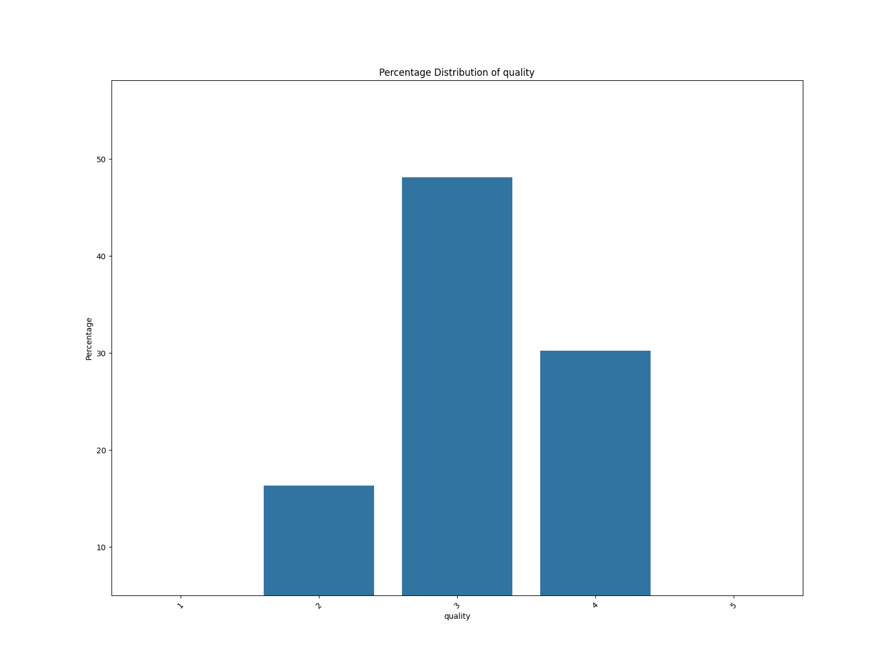

**Title: Unveiling the Narrative of Media Consumption: Insights from a Comprehensive Dataset**

In the world of media, where stories are told and retold, the consumption patterns across diverse formats offer a compelling narrative of cultural preferences and audience engagement. Our dataset, *media.csv*, encapsulates 2,652 distinct entries capturing various aspects of media – from films to literature, across multiple languages, and spanning multiple years.

### **The Missing Pieces of the Puzzle**

As we delve into our analysis, one notable observation is the presence of missing values, particularly in the 'by' column, where 262 entries remain uncredited. This gap raises intriguing questions about attribution in the media landscape. Who are the storytellers behind the works, and why are they not included? Are these missing credits a reflection of lesser-known creators or simply an oversight? Resolving these missing values could enrich our understanding of media authorship.

### **A Glimpse into Ratings and Quality**

The dataset offers a treasure trove of ratings, with the numerical summary revealing a mean 'overall' rating of 3.05 out of 5, indicating a generally favorable reception. The 'quality' ratings present an even brighter picture, averaging at 3.21. However, the repeatability scores hover around 1.49, suggesting that while media pieces may be well-received, they do not necessarily inspire repeated viewings or engagements.

The analysis further uncovers strong correlations among the variables 'overall', 'quality', and 'repeatability'. This connection suggests that higher quality ratings are likely to lead to better overall ratings, which in turn may influence the likelihood of repeat engagement. The challenge lies in determining how to leverage this insight to enhance media offerings and viewer retention.

### **Cultural Diversity in Language**

With entries spanning 11 unique languages, the dataset reflects a vibrant tapestry of cultural narratives. English emerges as the dominant language, with a staggering 1,306 entries, followed closely by Hindi and Telugu. This linguistic diversity invites exploration into how cultural contexts shape storytelling methods and audience reception. The prominence of English may suggest a broad global reach, while the presence of regional languages highlights the importance of local narratives in the media landscape.

### **Clustering the Data: Insights from Advanced Analysis**

Utilizing clustering techniques such as KMeans and hierarchical clustering, we can categorize media entries into three distinct groups. These clusters could reveal patterns in preferences or consumption behaviors, helping media producers tailor content to specific audience segments. For instance, if one cluster exhibits a preference for high-quality, repeatable films, it may prompt content creators to focus on developing sequels or expanding franchises that resonate with this audience.

### **Outliers and Anomalies: The Untold Stories**

Interestingly, our analysis did not reveal any outliers, suggesting that the dataset maintains a consistent narrative flow across its entries. However, the absence of outliers may also indicate a missed opportunity to explore unique or unconventional media that diverges from mainstream trends. These untold stories could offer insights into niche markets and audiences that are often overlooked.

### **Sample Rows: A Peek into the Media Landscape**

To illustrate the diversity and richness of this dataset, we can examine sample rows. For instance, the film *Dil Dhadakne Do*, featuring an ensemble cast including Anil Kapoor and Priyanka Chopra, received a quality rating of 4, suggesting a well-received narrative. In contrast, *Jab We Met*, a Hindi classic, also boasts high ratings, further emphasizing the appeal of romance and drama across cultures.

Moreover, the presence of lesser-known titles alongside blockbusters invites a discussion on the importance of supporting independent creators and diverse storytelling avenues.

### **Conclusion: The Future of Media Consumption**

As we weave together the threads of this narrative, several key takeaways emerge. The interplay between quality, overall ratings, and repeatability highlights the crucial role of storytelling in driving engagement. The diverse linguistic representation underscores the need for culturally rich media that resonates with various audiences.

To harness these insights, media producers must not only celebrate popular narratives but also explore the untapped potential of lesser-known creators and genres. By addressing gaps in attribution and focusing on quality content that encourages repeat engagement, the media landscape can evolve into a more inclusive and engaging realm for all.

In this age of information overload, understanding and telling the story behind the data is paramount. The journey through *media.csv* serves as a reminder that every piece of media has a story to tell – and by analyzing these narratives, we can pave the way for a more vibrant and inclusive media future.
### Exploratory Data Analysis
### CSV File Name: media.csv
### Dataset Overview
- **Shape:** 2652 rows and 8 columns
### Columns and Data Types:
```plaintext
date             object
language         object
type             object
title            object
by               object
overall           int64
quality           int64
repeatability     int64
```
### Sample Rows:
```plaintext
           date language         type                                      title                                                                          by  overall  quality  repeatability
1054  26-Sep-15    Hindi        movie                            Dil Dhadakne Do  Anil Kapoor, Ranbir Kapoor, Priyanka Chopra, Farhan Akhtar, Anushka Sharma        3        4              2
1906  02-Apr-08    Hindi        movie                             Johnny Gaddaar                                                                  Dharmendra        3        4              2
1560  29-Apr-10  English      fiction                          The Last Olympian                                                                Rick Riordan        3        3              2
905   24-Sep-17   Telugu        movie                 Cameraman Gangatho Rambabu                                                       Pawan Kalyan, Tamanna        2        3              2
1720  27-Feb-09  English  non-fiction                The Starfish and the Spider                                               Ori Brafman, Rod A. Beckstrom        3        3              2
1546  11-Jun-10    Tamil        movie                   Vinnai Thaandi Varuvaaya                                          Silambarasan, Trisha, Gautam Menon        2        3              1
1150  13-Dec-14  English        movie                            The Maze Runner                                              Dylan O'Brien, Kaya Scodelario        3        3              2
766   16-Dec-18   Telugu        movie                     Hello Guru Prema Kosam                                                            Ram, Prakash Raj        2        3              1
1881  12-May-08    Tamil        movie                                     Kuruvi                                                               Vijay, Trisha        2        2              1
2147  08-Nov-06  English      fiction                  The Count of Monte Cristo                                                             Alexandre Dumas        5        5              2
2163  26-Oct-06  English        movie                           The Conversation                                                                Gene Hackman        3        4              1
1548  08-Jun-10    Tamil        movie                                        Goa                                                Venkat Prabhu, Premji Amaran        3        3              2
2309  18-Apr-06    Tamil        movie                                     Anjali                                           Mani Rathnam, Revathi, Raghuvaran        4        5              2
1240  09-Mar-14  English      fiction                              The Kill List                                                           Frederick Forsyth        3        3              1
1871  01-Jun-08  English        movie                                  18 Again!                                                                George Burns        3        3              2
702   09-Feb-19  English    TV series                 Designated Survivor S02E17                                                           Kiefer Sutherland        3        3              1
694   15-Feb-19   Telugu        movie                                Arunachalam                                                                  Rajnikanth        3        3              2
1489  25-Feb-11  English        movie        Percy Jackson & the Lightning Thief                                            Logan Lerman, Alexandra Daddario        2        2              1
1762  13-Jan-09  English        movie                          On The Waterfront                                              Marlon Brando, Eva Marie Saint        3        4              1
1077  22-Jun-15  English        movie                              Run All Night                                                                 Liam Neeson        3        3              1
567   15-Sep-19  English        movie                                High Crimes                                                 Morgan Freeman, Ashley Judd        3        3              1
2411  08-Jan-06    Tamil        movie                                      Aanai                                                              Arjun, Namitha        2        2              1
335   15-Nov-21  English        movie  Shang-Chi and The Legend of the Ten Rings                                                                         NaN        3        3              1
536   09-Nov-19  English      fiction                              Heads You Win                                                              Jeffrey Archer        3        3              1
2498  01-Oct-05  English       script                       The Butterfly Effect                                                J. Mackye Gruber, Eric Bress        4        5              2
1822  18-Aug-08    Tamil        movie                             Chokka Thangam                                          Vijaykanth, Prakash Raj, Soundarya        3        2              2
1584  06-Feb-10  English        movie                           Kindergarten Cop                                  Arnold Schwarzenegger, Penelope Ann Miller        3        3              2
566   16-Sep-19  English        movie                  Spider-Man: Far From Home                                                                         NaN        3        4              1
1644  09-Jul-09    Tamil        movie                                   Thoranai                                                              Vishal, Shriya        3        3              1
518   15-Dec-19  English      fiction                            The Black Prism                                                                 Brent Weeks        3        4              1
21    22-Jun-24   Telugu        movie                                  Ramabanam                                   Gopichand, Dimple Hayathi, Jagapathi Babu        2        2              1
1651  01-Jul-09    Tamil        movie                               Guru En Aalu                                                             Madhavan, Abbas        2        2              2
2035  24-Jul-07  English        movie                                        FX2                                                  Bryan Brown, Brian Dennehy        3        3              2
1814  18-Sep-08    Tamil        movie                                    Sathyam                                                           Vishal, Nayantara        2        2              1
915   05-Aug-17    Tamil        movie                               Vikram Vedha                                                  Madhavan, Vijay Sethupathi        5        5              2
1573  19-Feb-10  English        movie                                   The Hire                                                                  Clive Owen        3        4              1
284   19-Feb-22  English        movie                                   Mr Right                                                 Sam Rockwell, Anna Kendrick        3        4              2
774   23-Nov-18   Telugu        movie                                    Rabhasa                                                            Jr NTR, Samantha        3        3              1
1209  22-May-14   Telugu        movie                                    Rechipo                                                               Nitin, Ileana        2        2              1
339   08-Nov-21    Tamil        movie                                   Jai Bhim                                                                       Surya        3        4              1
1264  11-Jan-14  English        movie                                 Die Hard 2                                                                Bruce Willis        4        4              2
908   16-Sep-17   Telugu        movie                           Oka  Laila Kosam                                                                         NaN        2        2              1
1581  10-Feb-10    Hindi        movie                                 Jab We Met                                               Kareena Kapoor, Shahid Kapoor        4        4              2
2036  24-Jul-07  English        movie                                   Insomnia                                Christopher Nolan, Al Pacino, Robin Williams        4        5              1
180   11-Oct-22    Tamil        movie                            Ponniyin Selvan                                     Mani Ratnam, Karthi, Jayam Ravi, Vikram        3        4              1
1446  04-Aug-11  English        movie                                       Thor                                            Chris Hemsworth, Natalie Portman        2        2              1
1497  05-Feb-11   Telugu        movie                                    Athidhi                                                     Mahesh Babu, Amrita Rao        3        3              2
345   30-Oct-21    Hindi        movie                    Shaadi Mein Zaroor Aana                                              Rajkummar Rao, Kriti Kharbanda        3        3              2
1116  19-Mar-15  English      fiction                         The Son of Neptune                                                                Rick Riordan        3        3              2
1061  30-Aug-15  English        movie                                Citizenfour                                                              Edward Snowden        3        4              1
```
### Basic Statistics
```plaintext
             date language   type              title                 by      overall      quality  repeatability
count        2553     2652   2652               2652               2390  2652.000000  2652.000000    2652.000000
unique       2055       11      8               2312               1528          NaN          NaN            NaN
top     21-May-06  English  movie  Kanda Naal Mudhal  Kiefer Sutherland          NaN          NaN            NaN
freq            8     1306   2211                  9                 48          NaN          NaN            NaN
mean          NaN      NaN    NaN                NaN                NaN     3.047511     3.209276       1.494721
std           NaN      NaN    NaN                NaN                NaN     0.762180     0.796743       0.598289
min           NaN      NaN    NaN                NaN                NaN     1.000000     1.000000       1.000000
25%           NaN      NaN    NaN                NaN                NaN     3.000000     3.000000       1.000000
50%           NaN      NaN    NaN                NaN                NaN     3.000000     3.000000       1.000000
75%           NaN      NaN    NaN                NaN                NaN     3.000000     4.000000       2.000000
max           NaN      NaN    NaN                NaN                NaN     5.000000     5.000000       3.000000
```
### Missing Values
```plaintext
date     99
by      262
```
## Correlation Matrix
```plaintext
                overall   quality  repeatability
overall        1.000000  0.825935       0.512600
quality        0.825935  1.000000       0.312127
repeatability  0.512600  0.312127       1.000000
```

## Outlier Detection
- **overall:** 1216 outliers
- **quality:** 24 outliers
- **repeatability:** 0 outliers
## Clustering Analysis
Cluster Labels:
| Cluster | Count |
|---------|-------|
| 0.0 | 1315 |
| 2.0 | 769 |
| 1.0 | 568 |

## Categorical Data Analysis
### Unique Value Count for All Categorical Columns
| Column | Unique Value Count |
|---------|--------------------|
| date | 2055 |
| language | 11 |
| type | 8 |
| title | 2312 |
| by | 1528 |

## Hierarchical Clustering

## Visualizations

