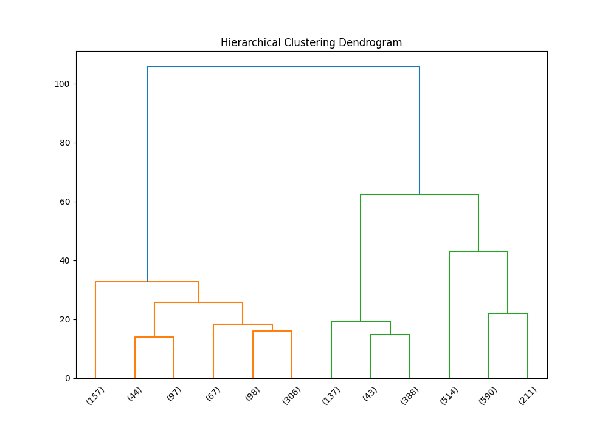

# Dataset Analysis Report
## CSV File Name: media.csv
## Dataset Overview
- **Shape:** 2652 rows and 8 columns
### Columns and Data Types:
```plaintext
date             object
language         object
type             object
title            object
by               object
overall           int64
quality           int64
repeatability     int64
```
### Sample Rows:
```plaintext
         date  language    type                                        title                                                        by  overall  quality  repeatability
0   15-Nov-24     Tamil   movie                                  Meiyazhagan                                      Arvind Swamy, Karthi        4        5              1
1   10-Nov-24     Tamil   movie                                    Vettaiyan                                   Rajnikanth, Fahad Fazil        2        2              1
2   09-Nov-24     Tamil   movie                                       Amaran                             Siva Karthikeyan, Sai Pallavi        4        4              1
3   11-Oct-24    Telugu   movie                                        Kushi                               Vijay Devarakonda, Samantha        3        3              1
4   05-Oct-24     Tamil   movie                                         GOAT                                                     Vijay        3        3              1
5   02-Oct-24    Telugu   movie                        Sanivaaram Saripodhaa                                            Nani, SJ Surya        3        3              1
6   01-Oct-24     Tamil   movie                                 Saba Nayagan                                              Ashok Selvan        3        3              2
7   30-Sep-24   English   movie                               Dune: Part Two                                Timothée Chalamet, Zendaya        3        4              1
8   10-Sep-24   English   movie                         Spencer Confidential                                             Mark Wahlberg        3        3              1
9   07-Sep-24   English   movie                                   Gemini Man                                                Will Smith        3        3              1
10  05-Sep-24     Tamil   movie                                         Arul                            Vikram, Jyothika, KS Ravikumar        3        3              2
11  26-Aug-24     Tamil   movie                                       Raayan                                                   Dhanush        3        4              1
12  25-Aug-24     Hindi   movie                                Lapata Ladies                                                       NaN        4        4              1
13  03-Aug-24   Spanish   movie                               Non Negotiable                                                       NaN        3        3              1
14  21-Jul-24  Japanese  series                              Attack on Titan                                                       NaN        5        5              2
15  13-Jul-24     Tamil   movie                                     Maharaja                                          Vijay Sethupathi        4        5              1
16  13-Jul-24     Tamil   movie                                       Vikram              Kamal Hassan, Fahaad Fazil, Vijay Sethupathi        3        4              2
17  09-Jul-24  Japanese  series                      One Punch Man: Season 2                                                       NaN        4        4              2
18  07-Jul-24  Japanese  series                      One Punch Man: Season 1                                                       NaN        4        4              2
19  29-Jun-24  Japanese  series                         Code Geass: Season 2                                                       NaN        4        4              1
20  26-Jun-24  Japanese  series                         Code Geass: Season 1                                                       NaN        4        4              1
21  22-Jun-24    Telugu   movie                                    Ramabanam                 Gopichand, Dimple Hayathi, Jagapathi Babu        2        2              1
22  16-Jun-24    Telugu   movie                       Padi Padi Leche Manasu                                   Sharwanand, Sai Pallavi        3        3              1
23  15-Jun-24     Hindi   movie                       Meri Brother Ki Dulhan                                  Imran Khan, Katrina Kaif        2        2              2
24  14-Jun-24     Tamil   movie                                  Por Thozhil                                Sarath Kumar, Ashok Selvan        3        4              1
25  14-Jun-24   English   movie                                  Madame Webb                                            Dakota Johnson        3        3              1
26  26-May-24     Tamil   movie                                Sigaram Thodu                                  Vikram Prabhu, Sathyaraj        3        3              1
27  21-May-24    Telugu   movie                        Bhale Bhale Magadivoy                                    Nani, Lavanya Tripathi        3        4              2
28  16-May-24    Telugu   movie                                 Alludu Seenu              Bellamkonda Sreenivas, Samantha, Prakash Raj        2        3              1
29  04-May-24    Telugu   movie                                  Family Star                          Vijay Devarakonda, Mrinal Thakur        3        3              2
30  01-May-24     Tamil   movie                                     Viswasam                                          Ajith, Nayantara        4        4              3
31  12-Apr-24     Hindi   movie                Rocky Aur Rani Ki Prem Kahani                  Ranveer Singh, Alia Bhatt, Jaya Bachchan        4        4              1
32  10-Apr-24    Telugu   movie                               Geeta Govindam                               Vijay Devarakonda, Rashmika        4        4              2
33  08-Apr-24   English   movie  Fantastic Beasts: The Secrets of Dumbledore                                     David Yates, Jude Law        3        4              2
34  07-Apr-24     Tamil   movie                                 Otha Seruppu                                                 Parthiban        3        3              1
35  07-Apr-24   English   movie                       A Brush With Christmas                                                       NaN        3        3              1
36  03-Apr-24    Telugu   movie                                        Kalki                                                Rajashekar        3        3              1
37  02-Apr-24    Telugu   movie                                        Eagle                                                 Ravi Teja        3        3              1
38  05-Mar-24     Hindi   movie                            Band Baaja Baarat                             Ranveer Singh, Anuksha Sharma        3        3              2
39  18-Feb-24     Hindi   movie                                   Atrangi Re                     Dhanush, Sara Ali Khan, Akshay Khanna        4        4              2
40  10-Feb-24    Telugu   movie                                   Ravanasura                                        Ravi Teja, Jayaram        2        2              1
41  10-Feb-24     Hindi   movie                                     Rajneeti                  Ranbir Kapoor, Ajay Devgan, Nana Patekar        4        4              2
42  09-Feb-24    Telugu   movie                                Guntur Karam                                   Mahesh Babu, Prakash Raj        2        3              1
43  07-Feb-24    Telugu   movie             Devil - The British Secret Agent                               Kalyan Ram, Samyuktha Menon        2        3              1
44  05-Feb-24     Tamil   movie                                        Kolai                                              Vijay Antony        2        3              1
45  31-Jan-24    Telugu   movie                                      Athidhi                                   Mahesh Babu, Amrita Rao        3        3              2
46  28-Jan-24     Tamil   movie                                    Maamannan  Mari Selvaraj, Vadivelu, Fahad Fazil, Udhayanidhi Stalin        4        4              1
47  28-Jan-24     Hindi   movie                                 Dream Girl 2                                         Ayushmann Khurana        3        3              1
48  26-Jan-24    Telugu   movie                                     Hi Nanna                                       Nani, Mrunal Thakur        3        4              2
49  17-Jan-24     Hindi   movie                           Satyaprem Ki Katha                                Varun Dhawan, Kiara Advani        3        3              1
```
## Basic Statistics
```plaintext
             date language   type              title                 by      overall      quality  repeatability
count        2553     2652   2652               2652               2390  2652.000000  2652.000000    2652.000000
unique       2055       11      8               2312               1528          NaN          NaN            NaN
top     21-May-06  English  movie  Kanda Naal Mudhal  Kiefer Sutherland          NaN          NaN            NaN
freq            8     1306   2211                  9                 48          NaN          NaN            NaN
mean          NaN      NaN    NaN                NaN                NaN     3.047511     3.209276       1.494721
std           NaN      NaN    NaN                NaN                NaN     0.762180     0.796743       0.598289
min           NaN      NaN    NaN                NaN                NaN     1.000000     1.000000       1.000000
25%           NaN      NaN    NaN                NaN                NaN     3.000000     3.000000       1.000000
50%           NaN      NaN    NaN                NaN                NaN     3.000000     3.000000       1.000000
75%           NaN      NaN    NaN                NaN                NaN     3.000000     4.000000       2.000000
max           NaN      NaN    NaN                NaN                NaN     5.000000     5.000000       3.000000
```
## Missing Values
```plaintext
date     99
by      262
```
## Correlation Matrix
```plaintext
                overall   quality  repeatability
overall        1.000000  0.825935       0.512600
quality        0.825935  1.000000       0.312127
repeatability  0.512600  0.312127       1.000000
```

## Outlier Detection
- **overall:** 1216 outliers
- **quality:** 24 outliers
- **repeatability:** 0 outliers
## Clustering Analysis
Cluster Labels:
| Cluster | Count |
|---------|-------|
| 0.0 | 1315 |
| 2.0 | 769 |
| 1.0 | 568 |

## Categorical Data Analysis
### Unique Value Count for All Categorical Columns
| Column | Unique Value Count |
|---------|--------------------|
| date | 2055 |
| language | 11 |
| type | 8 |
| title | 2312 |
| by | 1528 |

## Hierarchical Clustering

## Visualizations


## Hierarchical Clustering
